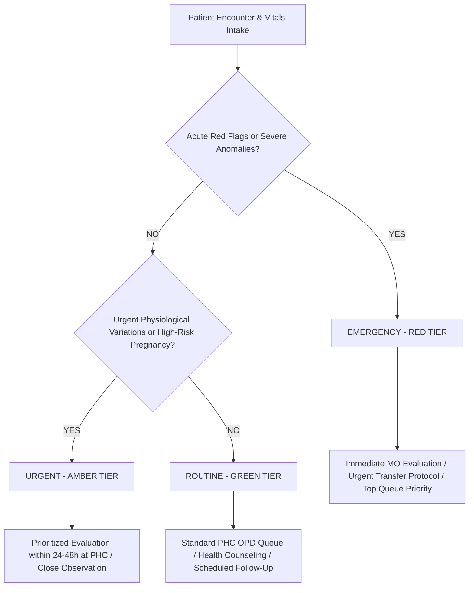

# CAREGRID: AI Clinical Triage & Decision Support Policy (Revised MVP)

> **SIH Problem Statement**: SIH26133 — Accessibility & Quality of Public Healthcare in Rural/Underserved Areas  
> **Jurisdiction**: Government of Maharashtra (Public Health Department / Arogya Vibhag)  
> **Clinical Standard**: IPHS / WHO Emergency Triage Assessment and Treatment (ETAT)  

---

## 1. Absolute Clinical Guardrails & Non-Diagnostic Mandate

### ⚠️ Fundamental Rule: AI Assists, Doctors Diagnose
1. **Zero Diagnostic Generation**: The CAREGRID AI Decision Support Service **never** outputs a medical diagnosis (e.g., "Patient has Myocardial Infarction" or "Pneumonia"). Instead, it outputs standardized **clinical urgency indicators**, physiological parameter alerts, and recommended public health specialties (e.g., "Urgency: High. Severe tachypnea and hypoxemia detected. Urgent medical officer evaluation and oxygen support indicated.").
2. **Zero Autonomous Prescriptions**: The AI service **never** generates pharmaceutical drug dosages or prescribes treatments.
3. **Mandatory Human-in-the-Loop**: All clinical evaluations, admissions, and treatments remain the sole legal and professional responsibility of licensed Medical Officers and registered healthcare professionals.
4. **Mandatory Legal Disclaimer**: Every UI screen and API response containing triage assistance displays this notice:
   > *"CAREGRID Clinical Triage Assist is an assistive decision-support algorithm designed to help certified healthcare workers prioritize clinical urgency in rural Maharashtra. It does NOT diagnose medical conditions or replace examination by a licensed medical officer."*

---

## 2. Clinical Urgency Priority Tiers

Every patient encounter evaluated by the triage engine is categorized into one of three standardized priority tiers:

### 🔴 1. EMERGENCY (RED TIER) — Target: Immediate Medical Officer Attention
- **Definition**: Critical physiological compromise threatening life, limb, or pregnancy.
- **Workflow Impact**:
  - Highlights encounter in pulsing RED in the ASHA interface and at the very top of the PHC OPD Queue.
  - Alerts the Medical Officer and recommends immediate facility transfer protocol to a secondary/tertiary hospital if required specialty is unavailable locally.

### 🟡 2. URGENT (AMBER TIER) — Target: Evaluation within 24–48 Hours
- **Definition**: Serious symptom presentation, gestational hypertension alert, or significant physiological anomaly that requires prioritized medical review.
- **Workflow Impact**:
  - Injects patient into the priority section of the PHC OPD Queue ahead of routine visits.
  - Generates a follow-up task for the village ASHA to verify condition within 24–48 hours.

### 🟢 3. ROUTINE (GREEN TIER) — Target: Standard Working Hours
- **Definition**: Stable vitals, minor common ailments, preventive antenatal visits, or routine follow-up.
- **Workflow Impact**:
  - Enrolled into regular OPD queue tokens or scheduled for routine community health worker visit.

---

## 3. Physiological Thresholds & Red Flag Rules (IPHS / ETAT Grounded)

### A. Adult Physiological Boundaries
| Parameter | Red (Emergency) | Amber (Urgent) | Normal Range |
| :--- | :---: | :---: | :---: |
| **Systolic Blood Pressure** | >= 180 or < 80 mmHg | 140–180 or 80–90 mmHg | 90–120 mmHg |
| **Diastolic Blood Pressure** | >= 120 or < 50 mmHg | 90–120 or 50–60 mmHg | 60–80 mmHg |
| **Oxygen Saturation (SpO2)** | < 90% on room air | 90% – 93% | 95% – 100% |
| **Heart Rate** | > 130 or < 40 bpm | 100–130 or 40–50 bpm | 60–100 bpm |
| **Respiratory Rate** | >= 32 or < 8 breaths/min | 22–31 breaths/min | 12–20 breaths/min |
| **Body Temperature** | >= 104°F or < 95°F | 101°F – 103.9°F | 97.5°F – 99.5°F |

### B. Maternal Danger Signs (National Health Mission - MCH Guidelines)
1. **Severe Pre-Eclampsia Alert**: BP >= 160/110 mmHg with severe headache, visual blurring, or epigastric discomfort.
2. **Antepartum / Postpartum Vaginal Bleeding**: Any active fresh bleeding in pregnancy or excessive bleeding post-delivery.
3. **Fetal Distress Alert**: Fetal Heart Rate < 110 bpm or > 160 bpm.

### C. Pediatric Danger Signs (IMNCI Standards)
1. Inability to drink or breastfeed.
2. Persistent vomiting of all fluids.
3. Lethargy, unconsciousness, or active convulsions.
4. Severe chest indrawing or stridor.
