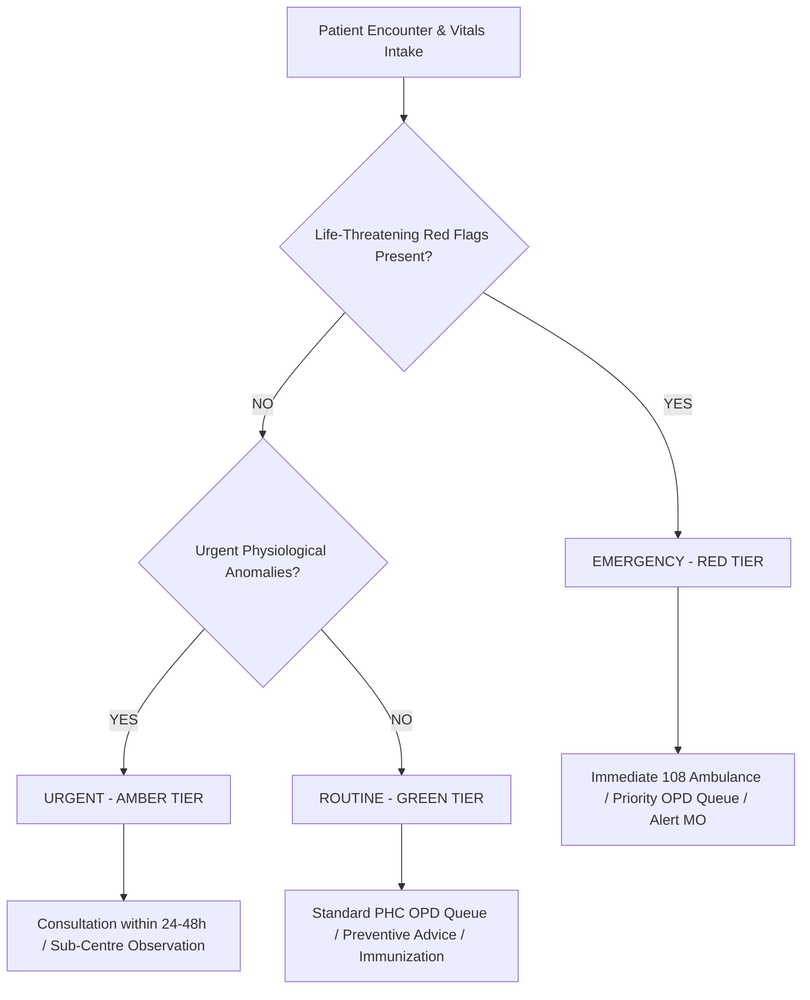

# CAREGRID: AI Clinical Triage & Decision Assist Policy

> **SIH Problem Statement**: SIH26133 — Accessibility & Quality of Public Healthcare in Rural/Underserved Areas  
> **Jurisdiction**: Government of Maharashtra (Public Health Department)  
> **Clinical Standard**: IPHS / WHO Emergency Triage Assessment and Treatment (ETAT)  

---

## 1. Absolute Clinical Guardrails & Non-Diagnostic Mandate

### ⚠️ Fundamental Rule: AI Assists, Doctors Diagnose
1. **Zero Diagnostic Generation**: The CAREGRID AI Decision Support Service **never** outputs a definitive diagnosis (e.g., "Patient has Myocardial Infarction"). Instead, it outputs clinical urgency indicators, physiological parameter alerts, and recommended next clinical steps (e.g., "Critical Urgency: Severe chest pain with tachycardia detected. Immediate transfer to facility with ECG and medical officer required.").
2. **Zero Autonomous Prescription**: The AI service **never** prescribes pharmaceutical dosages or schedules autonomous therapeutic interventions.
3. **Mandatory Human-in-the-Loop**: All clinical decisions, patient handovers, admissions, and treatments must be confirmed by a licensed medical practitioner.
4. **Mandatory Legal Disclaimer**: Every UI screen and API payload delivering triage assistance contains this immutable disclaimer:
   > *"CAREGRID Clinical Triage Assist is an assistive decision-support algorithm designed to help certified healthcare workers identify high-risk clinical urgency. It does NOT replace clinical examination or doctor's diagnosis."*

---

## 2. Clinical Urgency Priority Tiers

The triage engine categorizes every intake encounter into one of three standardized priority tiers:

### 🔴 1. EMERGENCY (RED TIER) — Target Response: Immediate
- **Definition**: Acute physiological compromise threatening life, limb, or pregnancy.
- **System Action**:
  - Highlights encounter in pulsing RED on ASHA device and PHC OPD Queue.
  - Automatically recommends nearest secondary/tertiary facility with emergency capability.
  - Generates immediate 108 ambulance dispatch prompt.

### 🟡 2. URGENT (AMBER TIER) — Target Response: < 24–48 Hours
- **Definition**: Serious condition or high-risk demographic needing prioritized medical review, but not in immediate cardiopulmonary collapse.
- **System Action**:
  - Injects patient to top of standard OPD queue above routine visits.
  - Generates follow-up reminder for ASHA within 24 hours.

### 🟢 3. ROUTINE (GREEN TIER) — Target Response: Standard Working Hours
- **Definition**: Stable chronic conditions, minor common ailments, preventive immunization, routine antenatal checks.
- **System Action**:
  - Scheduled into regular facility OPD queue or community health worker follow-up roster.

---

## 3. Physiological Thresholds & Red Flag Rules

The AI Decision Support Engine is grounded in evidence-based thresholds:

### A. General Adult Physiological Red Flags
| Parameter | Red (Emergency) | Amber (Urgent) | Normal Range |
| :--- | :---: | :---: | :---: |
| **Systolic Blood Pressure** | > 180 or < 80 mmHg | 140–180 or 80–90 mmHg | 90–120 mmHg |
| **Diastolic Blood Pressure** | > 120 or < 50 mmHg | 90–120 or 50–60 mmHg | 60–80 mmHg |
| **Oxygen Saturation (SpO2)** | < 90% on room air | 90% – 93% | 95% – 100% |
| **Heart Rate** | > 130 or < 40 bpm | 100–130 or 40–50 bpm | 60–100 bpm |
| **Respiratory Rate** | > 30 or < 8 breaths/min | 22–30 breaths/min | 12–20 breaths/min |
| **Body Temperature** | > 104°F or < 95°F | 101°F – 104°F | 97.5°F – 99.5°F |

### B. Maternal High-Risk Pregnancy (HRP) Danger Signs
1. **Severe Pre-Eclampsia / Eclampsia**: BP >= 160/110 mmHg with severe headache, visual blurring, or epigastric pain.
2. **Antepartum / Postpartum Hemorrhage**: Any fresh vaginal bleeding during pregnancy or excessive bleeding after delivery.
3. **Obstructed / Prolonged Labor**: Labor exceeding 12 hours or premature rupture of membranes > 18 hours.
4. **Fetal Heart Rate Distress**: FHR < 110 bpm or > 160 bpm.

### C. Pediatric Emergency Signs (IMNCI Standards)
1. Inability to breastfeed or drink fluids.
2. Vomiting everything consumed.
3. Active convulsions or lethargy/unconsciousness.
4. Severe chest indrawing or stridor while calm.
