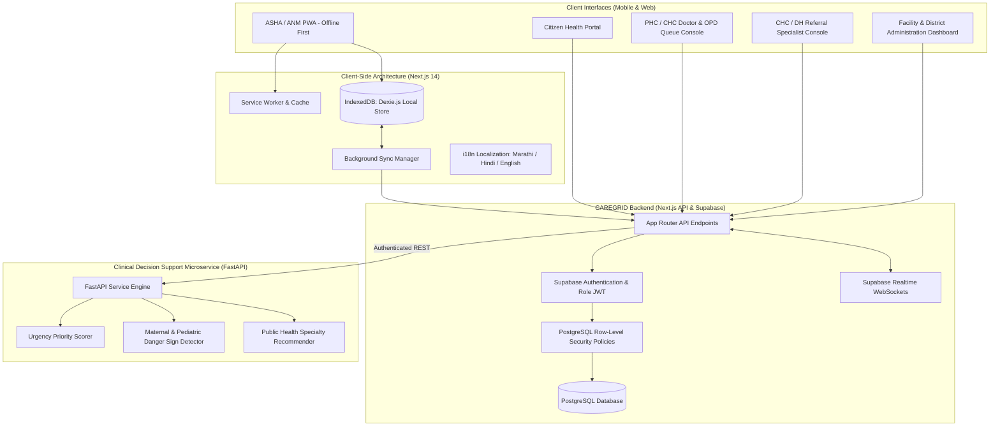

# CAREGRID: System Architecture & Technical Specifications (Revised MVP)

> **SIH Problem Statement**: SIH26133 — Accessibility & Quality of Public Healthcare in Rural/Underserved Areas  
> **Jurisdiction**: Government of Maharashtra (Public Health Department / Arogya Vibhag)  
> **Team**: The Glitch Gang (Team ID: 129855)  

---

## 1. Architectural Mission

CAREGRID is engineered specifically to eliminate friction across Maharashtra’s rural public healthcare continuum. Rather than attempting to manage emergency ambulance dispatch, live bed telemetry, or epidemiological forecasting, CAREGRID solves the core care coordination challenge:

1. **Front-line Health Worker Empowerment**: ASHAs and ANMs operate in intermittent/zero-connectivity environments to register citizens, record baseline vitals, and detect danger signs.
2. **Standardized Clinical Urgency Prioritization (Non-Diagnostic)**: AI-assisted clinical urgency classification (`emergency_red`, `urgent_amber`, `routine_green`) that helps field workers and PHC doctors prioritize care without autonomously diagnosing or prescribing.
3. **Streamlined Facility & Service Discovery**: Clear visibility into which Sub-Centres, PHCs, CHCs, and District Hospitals offer specific clinical services and specialties.
4. **Queue & Teleconsultation Coordination**: Token-based OPD queues that order patients by clinical urgency, with teleconsultation support connecting rural PHCs to district specialists.
5. **Closed-Loop Referral Tracking**: Ensuring patients referred to higher facilities are tracked through arrival, treatment, and discharge, with post-discharge follow-up tasks routed back to the village ASHA.
6. **Continuous Longitudinal Health Records**: A chronological health journey for every patient spanning encounters, vitals, triage records, and referrals.

---

## 2. High-Level Architecture Diagram



---

## 3. The 9-Stage Care Coordination Pipeline

```
[1. Citizen / Patient Intake]
      │
      ├── Self-registration or community outreach registration by ASHA
      └── Demographic capture, vulnerability flags (pregnancy, chronic disease)
      │
      ▼
[2. ASHA / ANM Field Workflow (Offline-First)]
      │
      ├── Home visits, vitals check (BP, SpO2, HR, Glucose, Temp)
      └── Offline caching in local IndexedDB with immediate danger-sign alerts
      │
      ▼
[3. Primary Care Facility (Sub-Centre / PHC / CHC)]
      │
      └── Patient arrives or records sync upon network availability
      │
      ▼
[4. AI-Assisted Triage & Priority Support (Non-Diagnostic)]
      │
      ├── Computes urgency tier: EMERGENCY (Red), URGENT (Amber), ROUTINE (Green)
      ├── Identifies vital anomalies & maternal/pediatric danger signs
      └── Strictly non-diagnostic; provides decision support for clinician
      │
      ▼
[5. Appointment / Queue / Teleconsultation Coordination]
      │
      ├── Digital OPD Queue sorted by clinical urgency tier
      └── Rural teleconsultation session linking PHC doctor to district specialist
      │
      ▼
[6. Closed-Loop Referral Tracking]
      │
      ├── Inter-facility referral created with clinical transfer summary
      ├── Receiving hospital acknowledges patient arrival
      └── Discharge note triggers counter-referral back to village level
      │
      ▼
[7. Diagnostics / Medicines / Services Availability]
      │
      ├── Discovery of available diagnostic tests and services by facility
      └── Orders linked directly to clinical encounter record
      │
      ▼
[8. Follow-up & Continuity of Care]
      │
      ├── Automated follow-up task generated for village ASHA
      └── Post-referral check, maternal ANC visit, or chronic medication check-in
      │
      ▼
[9. Facility & Government Dashboard]
      │
      └── Aggregated visibility into referral loop closure, queue volumes,
          triage distribution, and ASHA follow-up compliance across talukas
```

---

## 4. Offline-First Synchronization Architecture

The offline workflow guarantees that front-line workers in remote villages (e.g., Gadchiroli, Nandurbar, Melghat) can execute their duties without interruption:

1. **Client Persistence**:
   - `localPatients`: Stores registered patients and basic profiles locally.
   - `localEncounters`: Stores encounter records and vitals captured in the field.
   - `syncQueue`: An append-only log of pending mutations (`CREATE`, `UPDATE`).
   - `cachedFacilities`: Local directory of public health facilities in the worker's taluka/district.
2. **Automatic Synchronization**:
   - The `useNetworkStatus` hook detects `online` browser events.
   - The `SyncManager` batches pending records and transmits them to `/api/sync`.
   - Each offline record uses a client-generated UUID for idempotency, preventing duplicates.
3. **Conflict Resolution**:
   - Clinical encounters and vitals are append-only historical records.
   - Profile edits use server-authoritative timestamps with last-write-wins semantics.

---

## 5. Non-Diagnostic AI Triage Microservice Specifications

The AI Microservice strictly adheres to the non-diagnostic mandate:

- **Inputs**: Patient demographics (age, gender, pregnancy status, chronic conditions), vital signs (BP, SpO2, HR, RR, Temp, Blood Glucose, Fetal HR), and recorded symptoms.
- **Processing**:
  - `RedFlagDetector`: Evaluates physiological danger signs based on Indian Public Health Standards (IPHS) and WHO ETAT protocols.
  - `PriorityScorer`: Calculates a numerical priority score (1 to 10) and maps it to standardized Urgency Tiers:
    - **`emergency_red`**: Critical physiological distress; immediate medical officer attention and transfer needed.
    - **`urgent_amber`**: Significant clinical symptoms or high-risk vulnerability; prioritized review within 24-48 hours.
    - **`routine_green`**: Standard OPD consultation, preventive lifestyle guidance, or routine follow-up.
- **Outputs**:
  - `urgency_tier` (`emergency_red` | `urgent_amber` | `routine_green`)
  - `priority_score` (1-10)
  - `detected_red_flags` (List of clinical alerts)
  - `vital_anomalies` (List of abnormal vitals)
  - `transport_recommended` (Boolean flag)
  - `recommended_specialty` (Relevant public health specialty e.g. Obstetrics & Gynecology, Pediatrics, General Medicine)
  - `recommended_action` (Actionable guidance for ASHA/doctor)
  - `non_diagnostic_disclaimer` (Immutable legal notice)

---

## 6. Security, Privacy & Access Boundaries

- **Database Kernel RLS**: PostgreSQL Row-Level Security ensures that:
  - Patients can only view their own records.
  - ASHAs only access patients in their assigned village.
  - PHC doctors access patients registered at their facility or actively referred to/from it.
  - District/State administrators access aggregated, de-identified operational metrics.
- **Audit Logging**: Every read and write of protected health records is captured in an append-only `audit_logs` table.
