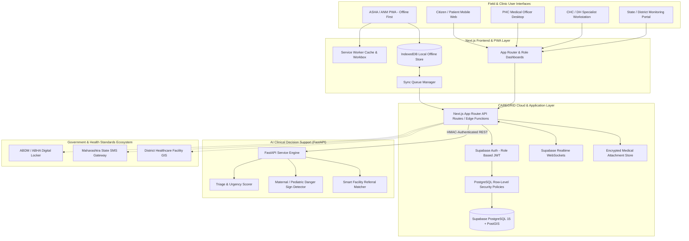

# CAREGRID: System Architecture & Technical Specifications

> **SIH Problem Statement**: SIH26133 — Accessibility & Quality of Public Healthcare in Rural/Underserved Areas  
> **Jurisdiction**: Government of Maharashtra (Public Health Department / Arogya Vibhag)  
> **Team**: The Glitch Gang (Team ID: 129855)  

---

## 1. Architectural Vision

CAREGRID is engineered to address the specific socio-geographical and infrastructural realities of rural Maharashtra:
1. **Low & Intermittent Connectivity**: High reliance on 2G/spotty 4G cellular coverage in remote talukas and hilly tribal regions (e.g., Gadchiroli, Nandurbar, Melghat).
2. **Tiered Public Healthcare System**: Sub-Centres (SC / Ayushman Arogya Mandir) at the village tier -> Primary Health Centres (PHC) at the cluster tier -> Community Health Centres (CHC) / Rural Hospitals (RH) at the block/taluka tier -> District Hospitals (DH) at the district tier.
3. **Clinical Safety & Non-Diagnostic Decision Support**: AI services are strictly decision-assistive tools designed to compute standardized clinical urgency tiers and detect danger signs for community workers, without ever prescribing or diagnosing autonomously.
4. **Data Sovereignty & Privacy**: Patient records are encrypted, auditable, and managed strictly through role-based access controls adhering to Indian healthcare guidelines.

---

## 2. High-Level System Architecture Diagram



---

## 3. Tiered Data & Referral Flow

The patient's journey through CAREGRID mirrors and strengthens Maharashtra's public health delivery model:

### Step 1: Village Outreach & Screening (Citizen & ASHA/ANM)
- ASHA worker visits households or conducts Village Health, Sanitation and Nutrition Days (VHSND).
- The ASHA launches the CAREGRID PWA on her mobile device.
- **Offline Registration**: Even without cellular connectivity, she can register a new patient, record baseline demographics, pregnancy status, immunization schedule, or chronic vitals (Blood Pressure, Blood Glucose, SpO2, Heart Rate, Temperature).
- **Offline Triage Rule-Engine**: A lightweight, pre-bundled client-side rule set evaluates immediate life-threatening danger signs (e.g., severe breathlessness, eclamptic seizures, postpartum hemorrhage) and alerts the ASHA to arrange immediate emergency transport.

### Step 2: Synchronization & Server-Side AI Assessment
- When the ASHA reaches a network hotspot or returns to the Sub-Centre/PHC, the **Sync Queue Manager** detects network availability.
- Encrypted encounter records are pushed to the backend via idempotent mutation endpoints.
- The backend dispatches an asynchronous call to the **FastAPI AI Decision Support Engine**.
- The AI service analyzes multi-parameter clinical inputs (vitals, symptoms duration, age group, maternal gestational age) and assigns a standardized **Clinical Urgency Tier**:
  - **EMERGENCY (Red)**: Immediate physician attention required; automated alert pushed to receiving PHC/CHC.
  - **URGENT (Amber)**: Prioritized consultation within 24-48 hours.
  - **ROUTINE (Green)**: Standard OPD consultation, preventive lifestyle guidance, routine medication refill.

### Step 3: Primary Consultation & Queue Management (PHC)
- The patient arrives at the Primary Health Centre.
- The Medical Officer (MO) views the patient in the **Digital OPD Queue**, where patients are sorted by clinical urgency tier rather than pure arrival time.
- The MO reviews the longitudinal record, validates the ASHA's intake notes, enters clinical findings, prescribes medications from the facility formulary, and orders diagnostic lab tests.

### Step 4: Closed-Loop Referral (PHC -> CHC / Sub-District Hospital / District Hospital)
- If specialized care (surgical intervention, ultrasound, pediatric ICU, high-risk obstetrics) is required, the MO initiates a **Digital Referral**.
- CAREGRID's **Facility Service Matcher** analyzes nearby secondary/tertiary public health facilities based on:
  - Distance and route transport viability.
  - Real-time availability of required medical specialties and functional ICU/maternity beds.
- The receiving facility receives a real-time referral intake notification with full clinical summary and reason for transfer.
- When the patient arrives at the referral center, the referral is marked "Admitted/Acknowledged".
- Upon discharge, the specialist enters a counter-referral discharge summary. This automatically flows back to the referring PHC MO and the village ASHA for home-based post-discharge monitoring.

### Step 5: Follow-Up & Continuous Care Loop
- Automated follow-up tasks are scheduled for the village ASHA:
  - Post-discharge monitoring (wound care, medication adherence).
  - High-risk pregnant women (ANC 1, 2, 3, 4 milestone visits).
  - Child immunization schedule alerts.
- Unresolved or missed follow-ups trigger alerts on the Taluka Health Officer (THO) dashboard.

### Step 6: Government & Facility Administrative Visibility
- Aggregated, de-identified healthcare intelligence feeds into the District and State Dashboard:
  - Real-time taluka-wise fever/respiratory cluster detection.
  - Facility bed occupancy and critical medicine inventory levels.
  - Referral drop-off rates (identifying patients who were referred but never reached the higher facility).
  - High-Risk Pregnancy (HRP) mapping across rural blocks.

---

## 4. Offline-First Synchronization Architecture

To guarantee 100% operational continuity in zero-reception areas, CAREGRID adopts an **Optimistic Local-First Offline Architecture**:

```
[Local User Action in PWA]
          │
          ▼
[IndexedDB: Store local document with status="PENDING_SYNC"]
          │
          ├──> [Immediate UI Update (Optimistic Response)]
          │
[Network Listener: 'online' Event Triggered]
          │
          ▼
[Sync Queue Worker: Batch Process Pending Payloads]
          │
          ├──> Generate idempotency key (UUID v4 + timestamp)
          │
          ├──> POST /api/sync/batch
          │
          ▼
[Server: Validate JWT, Check Collision / Versioning]
          │
          ├──> Success: Server persists record, returns canonical ID & updated_at
          │           Client marks record status="SYNCED"
          │
          └──> Conflict: Server-authoritative timestamping with non-destructive merge
```

### Key Offline Features:
1. **Client Persistence Engine**: Built on IndexedDB using `Dexie.js` for structured local tables:
   - `local_patients`: Offline patient cache and new registrations.
   - `local_encounters`: Offline clinical visits, vitals readings, and notes.
   - `sync_queue`: Ordered transaction log of pending create/update actions.
   - `cached_facilities`: Read-only offline directory of public health facilities in the user's district.
2. **Idempotency & Replay Protection**: Every transaction generated offline is assigned a cryptographic UUID client-side. If a sync request is partially transmitted due to dropped signal, retries will not duplicate patient or encounter records.
3. **Conflict Resolution Strategy**:
   - For transactional events (e.g., new vitals reading, new encounter note): Append-only semantics prevent overwrite collisions.
   - For mutable master records (e.g., patient address, phone number): Server-authoritative "Last-Write-Wins" using ISO 8601 UTC microsecond timestamps.

---

## 5. Security & Privacy Layer Architecture

1. **Authentication**:
   - Supabase Auth utilizing JSON Web Tokens (JWT).
   - Multi-factor authentication / OTP support for field workers and clinical officers.
2. **Row-Level Security (RLS)**:
   - Multi-tenant data segregation enforced directly within PostgreSQL kernel.
   - Security cannot be bypassed by frontend API misconfigurations.
3. **Data Encryption**:
   - Data in Transit: TLS 1.3 mandatory across all client-server and inter-service channels.
   - Data at Rest: AES-256 encryption on database volumes and object storage buckets.
4. **Audit Logging**:
   - Append-only PostgreSQL audit log recording `actor_id`, `patient_id`, `action_type`, `ip_address`, and `timestamp` for every PHI read and write event.

---

## 6. AI Microservice Architecture (FastAPI)

The AI Microservice operates as a standalone stateless service isolated from direct public internet exposure:

```
[Next.js API Gateway]
        │
        │ Internal REST call (HMAC Secret + Request ID)
        ▼
[FastAPI Microservice (Port 8000)]
  ├── Middlewares:
  │     ├── SecurityHeaderMiddleware
  │     ├── APIKeyAuthMiddleware
  │     └── ClinicalAuditMiddleware
  │
  ├── Routers:
  │     ├── /api/v1/healthcheck
  │     ├── /api/v1/triage/assess
  │     └── /api/v1/facility/recommend-referral
  │
  └── Services:
        ├── RedFlagDetector: Rule-based maternal & pediatric emergency detection
        ├── PriorityScorer: Standardized clinical urgency matrix calculation
        └── TriageEngine: Synthesizes urgency tier + clinical disclaimers
```

### Safety Guarantees:
- **Zero Hallucination Guardrail**: Urgency categorization is strictly deterministic, bounded by validated clinical thresholds (IPHS / Emergency Triage Assessment and Treatment - ETAT).
- **Mandatory Disclaimers**: Every response payload programmatically includes legal non-diagnostic disclaimers and requires clinician acknowledgment.
