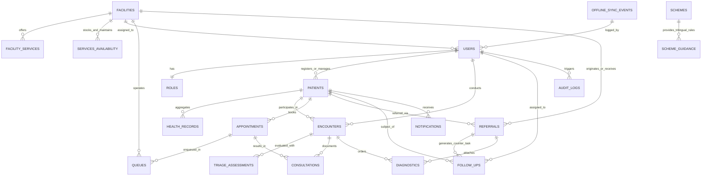

# CAREGRID Backend Schema Specification v1.0
## PostgreSQL & Supabase Relational Data Model

---

| Document Metadata | Details |
| :--- | :--- |
| **Document Title** | **CAREGRID Backend Schema Specification** |
| **Document Version** | **1.0 (Canonical Implementation Reference)** |
| **Publication Date** | September 19, 2026 |
| **Base References** | [`docs/PRD-v1.0.md`](file:///c:/Users/CAREGRID/docs/PRD-v1.0.md) & [`docs/TRD-v1.0.md`](file:///c:/Users/CAREGRID/docs/TRD-v1.0.md) |
| **Problem Statement** | **SIH26133**: Accessibility & Quality of Public Healthcare in Rural/Underserved Areas |
| **Nodal Jurisdiction** | **Government of Maharashtra** — Public Health Department (सार्वजनिक आरोग्य विभाग) |
| **Target Database** | PostgreSQL 15+ (Supabase / Maharashtra State Data Centre GovCloud) |
| **Client Edge DB** | IndexedDB via Dexie.js (`CareGridOfflineDB`) |
| **Design Paradigm** | Offline-First, Minimum Necessary Data, RLS-Enforced Security, Auditable State Transitions |

---

## 1. Executive Summary & Core Schema Principles

The CAREGRID data model is engineered to support an uninterrupted, closed-loop rural care continuum. The schema balances edge autonomy (offline ASHA and PHC workflows) with rigorous central relational integrity.

### 1.1 Core Schema Principles
1. **Minimum Necessary Health Data**: Collects only clinical indicators essential for immediate triage, referral coordination, and continuity of care. Excludes unnecessary personal, financial, or genetic identifiers.
2. **Deterministic Edge Identifiers**: Every entity utilizes client-generable UUIDv4 primary keys. This guarantees conflict-free concurrent creation across offline mobile devices and field workstations.
3. **Strict Non-Diagnostic Representation**: The database models clinical urgency tiers (`emergency_red`, `urgent_amber`, `routine_green`), physiological vitals, and danger signs. It contains **zero** tables or fields for autonomous disease classification or automated drug prescription generation.
4. **Transparent Audit Trails**: Every clinical urgency override, referral status transition, and teleconsultation entry maintains immutable user attribution and justification timestamps.
5. **Strict SIH26133 Boundaries**: Strictly **zero** database tables or columns for water-quality sensors, epidemiological outbreak prediction algorithms, 108 ambulance fleet dispatch, or real-time inpatient bed tracking.
6. **Planned Standards Alignment**: Entities utilize neutral identifiers (`CARE-MH-[YEAR]-[HEX]`) and mirror HL7 FHIR Release 4 conceptual models as a **planned, standards-aligned direction**, without claiming uncertified ABDM/FHIR compliance.

---

## 2. Entity Relationship Overview



---

## 3. PostgreSQL Enumerated Types (Enums)

```sql
-- 1. System Roles
CREATE TYPE user_role_enum AS ENUM (
    'citizen',
    'asha_worker',
    'anm_worker',
    'medical_officer',
    'specialist_doctor',
    'administrative_officer'
);

-- 2. Healthcare Facility Hierarchy (Maharashtra Public Health)
CREATE TYPE facility_type_enum AS ENUM (
    'sub_centre',              -- Arogyavardhini / Sub-Centre (Village/Cluster level)
    'phc',                     -- Primary Health Centre (Taluka peripheral level)
    'chc',                     -- Community Health Centre / Rural Hospital (RH)
    'sub_district_hospital',   -- Sub-District Hospital (SDH - 50/100 beds)
    'district_hospital'        -- District Hospital (DH - Tertiary public care)
);

-- 3. Standardized Urgency Classification (Non-Diagnostic)
CREATE TYPE urgency_tier_enum AS ENUM (
    'emergency_red',   -- Immediate clinical attention required (Pulsing Red)
    'urgent_amber',    -- Priority clinical review within 60 minutes (Amber)
    'routine_green'    -- Standard outpatient queue order (Green)
);

-- 4. Closed-Loop Referral Lifecycle
CREATE TYPE referral_status_enum AS ENUM (
    'initiated',       -- Referral created at peripheral facility
    'acknowledged',    -- Receiving hospital confirms intake availability
    'evaluated',       -- Specialist evaluation completed
    'completed',       -- Patient discharged; counter-task generated
    'cancelled'        -- Referral retracted with justification
);

-- 5. Outpatient Queue & Token Status
CREATE TYPE appointment_status_enum AS ENUM (
    'in_queue',
    'in_consultation',
    'completed',
    'referred',
    'no_show'
);

-- 6. Follow-Up Task Status
CREATE TYPE follow_up_status_enum AS ENUM (
    'pending',
    'completed',
    'escalated',
    'missed'
);

-- 7. Sync Event Status
CREATE TYPE sync_status_enum AS ENUM (
    'PENDING',
    'SYNCING',
    'FAILED',
    'RESOLVED'
);
```

---

## 4. The 20 Entity Specifications

---

### Entity 1: `users`
- **Purpose**: System identity accounts for healthcare personnel, administrative supervisors, and registered citizens.
- **Fields**:
  - `id` (UUID, PK): Unique user identifier (matches Supabase Auth `auth.users.id`).
  - `role_id` (VARCHAR(32), FK $\rightarrow$ `roles.id`): Assigned authorization role.
  - `facility_id` (UUID, FK $\rightarrow$ `facilities.id`, Optional): Assigned workplace.
  - `full_name` (VARCHAR(255), Required): Legal name.
  - `phone` (VARCHAR(15), Required, Unique): Mobile number for authentication/SMS.
  - `email` (VARCHAR(255), Optional, Unique): Professional email address.
  - `assigned_village` (VARCHAR(100), Optional): Village jurisdiction for ASHA workers.
  - `assigned_taluka` (VARCHAR(100), Optional): Taluka jurisdiction for supervisors.
  - `assigned_district` (VARCHAR(100), Required): Administrative district (e.g., 'Gadchiroli').
  - `is_active` (BOOLEAN, Default TRUE): Account status flag.
  - `created_at` (TIMESTAMPTZ, Default NOW()): Creation timestamp.
  - `updated_at` (TIMESTAMPTZ, Default NOW()): Modification timestamp.
- **Indexes**: `CREATE INDEX idx_users_phone ON users(phone);`, `CREATE INDEX idx_users_facility ON users(facility_id);`
- **Audit**: Track logins, password resets, and role modifications via `audit_logs`.
- **RBAC**: Administrative officers manage user accounts within their assigned district; users read/edit their own profile.
- **Offline Sync**: User credentials and profile caches are stored in browser localStorage / IndexedDB for offline access validation.

---

### Entity 2: `roles`
- **Purpose**: Canonical definitions of authorization roles and permissions.
- **Fields**:
  - `id` (VARCHAR(32), PK): Short key (`citizen`, `asha_worker`, `medical_officer`, `specialist_doctor`, `administrative_officer`).
  - `role_name` (VARCHAR(64), Required): Human-readable role label.
  - `description` (TEXT, Optional): Scope of access and clinical responsibilities.
  - `created_at` (TIMESTAMPTZ, Default NOW()): Definition timestamp.
- **Indexes**: PK indexed by default.
- **Audit**: System table; modifications restricted to super-administrators.
- **RBAC**: Read-only for all authenticated roles.
- **Offline Sync**: Static dictionary pre-baked into application code.

---

### Entity 3: `facilities`
- **Purpose**: Master directory of public healthcare infrastructure across Maharashtra.
- **Fields**:
  - `id` (UUID, PK): Unique facility identifier.
  - `facility_code` (VARCHAR(32), Required, Unique): State facility registration code.
  - `name` (VARCHAR(255), Required): Official name (e.g., 'Chamorshi Primary Health Centre').
  - `facility_type` (facility_type_enum, Required): Tier in health hierarchy.
  - `district` (VARCHAR(100), Required): District (e.g., 'Gadchiroli').
  - `taluka` (VARCHAR(100), Required): Taluka (e.g., 'Chamorshi').
  - `village` (VARCHAR(100), Optional): Village/Town location.
  - `address` (TEXT, Required): Postal address.
  - `latitude` (NUMERIC(10, 7), Optional): GPS latitude for offline distance sorting.
  - `longitude` (NUMERIC(10, 7), Optional): GPS longitude.
  - `contact_phone` (VARCHAR(20), Required): Landline or official mobile number.
  - `operating_hours` (VARCHAR(100), Required): Operational timings (e.g., '24/7' or '08:00 - 14:00').
  - `is_emergency_24_7` (BOOLEAN, Default FALSE): Round-the-clock emergency capability.
  - `created_at` (TIMESTAMPTZ, Default NOW()): Record creation timestamp.
  - `updated_at` (TIMESTAMPTZ, Default NOW()): Last update timestamp.
- **Indexes**: `CREATE INDEX idx_facilities_district_taluka ON facilities(district, taluka);`, `CREATE INDEX idx_facilities_type ON facilities(facility_type);`
- **Audit**: Modifications logged in `audit_logs`.
- **RBAC**: Read-only for citizens and field workers; facility administrators edit their facility profile.
- **Offline Sync**: Complete district facility directories are pre-cached in IndexedDB `localFacilities` table.

---

### Entity 4: `facility_services`
- **Purpose**: Catalog of functional clinical specialties, diagnostic tests, and public health programs offered at a facility.
- **Fields**:
  - `id` (UUID, PK): Unique record identifier.
  - `facility_id` (UUID, FK $\rightarrow$ `facilities.id`, Required): Parent facility.
  - `service_name` (VARCHAR(100), Required): Service title (e.g., 'Obstetrics & Gynecology', 'Sonography', 'Minor OT').
  - `category` (VARCHAR(64), Required): Grouping (`clinical_specialty`, `diagnostic_imaging`, `laboratory`, `maternal_child`).
  - `is_available` (BOOLEAN, Default TRUE): Active availability flag.
  - `days_offered` (VARCHAR(100), Default 'All Days'): Operational schedule (e.g., 'Mon, Wed, Fri').
  - `created_at` (TIMESTAMPTZ, Default NOW()): Creation timestamp.
- **Indexes**: `CREATE INDEX idx_facility_services_facility ON facility_services(facility_id);`
- **Audit**: Log service suspension or resumption.
- **RBAC**: Medical Officers update their own facility service status; public read-only.
- **Offline Sync**: Bundled with facility cache in client IndexedDB.

---

### Entity 5: `patients`
- **Purpose**: Core demographic and vulnerability profile of registered citizens.
- **Fields**:
  - `id` (UUID, PK): Unique patient identifier (UUIDv4 generated on device).
  - `health_id_code` (VARCHAR(32), Required, Unique): State-standard neutral identifier (`CARE-MH-YYYY-XXXX`).
  - `full_name` (VARCHAR(255), Required): Full legal name.
  - `age` (INT, Required): Age in completed years ($0 \le age \le 125$).
  - `gender` (VARCHAR(16), Required): Biological sex (`male`, `female`, `other`).
  - `phone` (VARCHAR(15), Optional): Mobile contact number.
  - `village` (VARCHAR(100), Required): Village / hamlet of residence.
  - `taluka` (VARCHAR(100), Required): Taluka of residence.
  - `district` (VARCHAR(100), Required): District of residence.
  - `is_pregnant` (BOOLEAN, Default FALSE): Active maternal status.
  - `gestational_age_weeks` (INT, Optional): Pregnancy gestation in weeks ($1 \le weeks \le 44$).
  - `high_risk_pregnancy` (BOOLEAN, Default FALSE): Clinical high-risk maternal indicator.
  - `chronic_conditions` (TEXT[], Optional): Array of diagnosed NCDs (e.g., `{'Hypertension', 'Diabetes'}`).
  - `assigned_asha_id` (UUID, FK $\rightarrow$ `users.id`, Optional): Dedicated village health worker.
  - `primary_facility_id` (UUID, FK $\rightarrow$ `facilities.id`, Optional): Nearest Sub-Centre / PHC.
  - `created_at` (TIMESTAMPTZ, Default NOW()): Registration timestamp.
  - `updated_at` (TIMESTAMPTZ, Default NOW()): Last profile edit timestamp.
- **Indexes**: `CREATE INDEX idx_patients_village ON patients(village);`, `CREATE INDEX idx_patients_high_risk ON patients(high_risk_pregnancy);`, `CREATE INDEX idx_patients_health_id ON patients(health_id_code);`
- **Audit**: Changes to pregnancy status or chronic conditions require source attribution.
- **RBAC**: ASHA workers read/write patients within their assigned village. Medical Officers access patients across their referring facility catchment. Administrators have strictly **zero** direct access to identifiable patient records.
- **Offline Sync**: Synchronized bidirectionally; client IndexedDB `localPatients` serves as the primary edge store.

---

### Entity 6: `health_records`
- **Purpose**: Unified longitudinal health timeline aggregating patient encounters, triage evaluations, referrals, and follow-ups.
- **Fields**:
  - `id` (UUID, PK): Unique record identifier.
  - `patient_id` (UUID, FK $\rightarrow$ `patients.id`, Required): Target patient.
  - `record_type` (VARCHAR(32), Required): Event category (`registration`, `vitals_screening`, `encounter`, `referral`, `follow_up`).
  - `event_date` (TIMESTAMPTZ, Required): Date of clinical occurrence.
  - `facility_id` (UUID, FK $\rightarrow$ `facilities.id`, Optional): Location of care.
  - `provider_id` (UUID, FK $\rightarrow$ `users.id`, Required): Attending healthcare personnel.
  - `summary` (TEXT, Required): Clinician-entered or system-aggregated event summary.
  - `metadata` (JSONB, Optional): Structured event payload (e.g., blood pressure values, referral code).
  - `created_at` (TIMESTAMPTZ, Default NOW()): System logging timestamp.
- **Indexes**: `CREATE INDEX idx_health_records_patient_date ON health_records(patient_id, event_date DESC);`
- **Audit**: Append-only ledger; modifications prohibited.
- **RBAC**: Visible to patient (Citizen Portal), assigned ASHA, and treating physicians.
- **Offline Sync**: Reconstituted dynamically in client IndexedDB by joining local encounters, referrals, and tasks.

---

### Entity 7: `encounters`
- **Purpose**: Interaction record of an outpatient consultation, community vitals check, or teleconsultation.
- **Fields**:
  - `id` (UUID, PK): Unique encounter identifier.
  - `patient_id` (UUID, FK $\rightarrow$ `patients.id`, Required): Patient receiving care.
  - `facility_id` (UUID, FK $\rightarrow$ `facilities.id`, Optional): Facility where encounter occurred (NULL for home visit).
  - `provider_id` (UUID, FK $\rightarrow$ `users.id`, Required): ASHA, ANM, or Doctor conducting encounter.
  - `encounter_type` (VARCHAR(32), Required): `community_screening`, `opd_consultation`, `teleconsultation`, `follow_up_visit`.
  - `systolic_bp` (INT, Optional): Systolic blood pressure (mmHg).
  - `diastolic_bp` (INT, Optional): Diastolic blood pressure (mmHg).
  - `heart_rate` (INT, Optional): Pulse rate (bpm).
  - `spo2_percentage` (INT, Optional): Blood oxygen saturation ($0 \le SpO_2 \le 100$).
  - `blood_glucose_mg_dl` (NUMERIC(5,1), Optional): Random or fasting blood sugar.
  - `temperature_fahrenheit` (NUMERIC(4,1), Optional): Body temperature.
  - `danger_signs_present` (TEXT[], Optional): Red flags checked during screening.
  - `clinical_notes` (TEXT, Optional): Clinician observation notes.
  - `created_at` (TIMESTAMPTZ, Default NOW()): Screening timestamp.
- **Indexes**: `CREATE INDEX idx_encounters_patient ON encounters(patient_id);`, `CREATE INDEX idx_encounters_created ON encounters(created_at DESC);`
- **Audit**: Clinician signature and device ID logged upon sync.
- **RBAC**: Creating provider and treating physicians read/write; patient reads own history.
- **Offline Sync**: Persisted in IndexedDB `localEncounters`; enqueued in `syncQueue`.

---

### Entity 8: `triage_assessments`
- **Purpose**: Assistive, non-diagnostic urgency prioritization calculation and doctor override log.
- **Fields**:
  - `id` (UUID, PK): Unique triage assessment identifier.
  - `encounter_id` (UUID, FK $\rightarrow$ `encounters.id`, Required): Parent encounter.
  - `patient_id` (UUID, FK $\rightarrow$ `patients.id`, Required): Evaluated patient.
  - `urgency_tier` (urgency_tier_enum, Required): Computed priority (`emergency_red`, `urgent_amber`, `routine_green`).
  - `score` (INT, Required): Deterministic urgency weight ($1 \le score \le 3$).
  - `clinical_triggers` (TEXT[], Required): Transparent physiological explanations.
  - `recommended_specialty` (VARCHAR(100), Optional): Suggested public health specialty.
  - `is_overridden_by_doctor` (BOOLEAN, Default FALSE): Indicates clinician override.
  - `doctor_override_tier` (urgency_tier_enum, Optional): Clinician-selected tier.
  - `doctor_override_reason` (TEXT, Optional): Mandatory clinical justification for override.
  - `overriding_doctor_id` (UUID, FK $\rightarrow$ `users.id`, Optional): Overriding physician.
  - `disclaimer_acknowledged` (BOOLEAN, Default TRUE): Confirms non-diagnostic disclaimer display.
  - `created_at` (TIMESTAMPTZ, Default NOW()): Assessment timestamp.
- **Indexes**: `CREATE INDEX idx_triage_tier ON triage_assessments(urgency_tier);`, `CREATE INDEX idx_triage_encounter ON triage_assessments(encounter_id);`
- **Audit**: Mandatory logging of physician overrides with timestamp and rationale.
- **RBAC**: Evaluated by system heuristics; modified exclusively by Medical Officers.
- **Offline Sync**: Computed locally on device in < 10ms; synchronizes alongside encounter payload.

---

### Entity 9: `appointments`
- **Purpose**: Physical or teleconsultation booking records and OPD queue entries.
- **Fields**:
  - `id` (UUID, PK): Unique appointment identifier.
  - `patient_id` (UUID, FK $\rightarrow$ `patients.id`, Required): Patient booked.
  - `facility_id` (UUID, FK $\rightarrow$ `facilities.id`, Required): Target health facility.
  - `appointment_type` (VARCHAR(32), Required): `physical_opd` or `teleconsultation`.
  - `queue_tier` (urgency_tier_enum, Required): Clinical priority tier determining queue position.
  - `scheduled_time` (TIMESTAMPTZ, Required): Slot time or walk-in arrival time.
  - `status` (appointment_status_enum, Default 'in_queue'): Consultation workflow state.
  - `created_at` (TIMESTAMPTZ, Default NOW()): Generation timestamp.
- **Indexes**: `CREATE INDEX idx_appointments_facility_status ON appointments(facility_id, status);`
- **Audit**: Status changes (`in_queue` $\rightarrow$ `in_consultation` $\rightarrow$ `completed`) time-stamped.
- **RBAC**: Issued by ASHA or PHC registration staff; managed by Medical Officers.
- **Offline Sync**: Persisted in IndexedDB `localAppointments`.

---

### Entity 10: `queues`
- **Purpose**: Daily OPD token sequence management per facility and department.
- **Fields**:
  - `id` (UUID, PK): Unique queue item identifier.
  - `facility_id` (UUID, FK $\rightarrow$ `facilities.id`, Required): Host facility.
  - `appointment_id` (UUID, FK $\rightarrow$ `appointments.id`, Required): Linked appointment.
  - `token_number` (VARCHAR(16), Required): Display token (e.g., `#01`, `#02`).
  - `queue_date` (DATE, Required): Calendar day of queue session.
  - `priority_rank` (INT, Required): Computed sorting index ($1 = \text{Highest}$).
  - `called_at` (TIMESTAMPTZ, Optional): Time called into doctor consultation room.
  - `completed_at` (TIMESTAMPTZ, Optional): Consultation completion timestamp.
- **Indexes**: `CREATE INDEX idx_queues_facility_date ON queues(facility_id, queue_date, priority_rank);`
- **Audit**: Token call and wait time metrics computed for administrative visibility.
- **RBAC**: Read-only on waiting area displays; writable by PHC registration desk and doctor.
- **Offline Sync**: Managed in client-side memory and IndexedDB queue table.

---

### Entity 11: `consultations`
- **Purpose**: Detailed clinical notes, advised investigations, and teleconsultation logs recorded by treating doctors.
- **Fields**:
  - `id` (UUID, PK): Unique consultation identifier.
  - `appointment_id` (UUID, FK $\rightarrow$ `appointments.id`, Required): Linked appointment.
  - `patient_id` (UUID, FK $\rightarrow$ `patients.id`, Required): Patient treated.
  - `doctor_id` (UUID, FK $\rightarrow$ `users.id`, Required): Attending physician.
  - `chief_complaint` (TEXT, Required): Patient-reported symptoms and duration.
  - `clinical_examination` (TEXT, Required): Doctor's physical examination findings.
  - `provisional_diagnosis_text` (TEXT, Optional): Clinician's manual clinical impression (clinician-entered only).
  - `treatment_plan` (TEXT, Required): Clinical advice, dietary instructions, and home care.
  - `is_teleconsultation` (BOOLEAN, Default FALSE): Virtual consult flag.
  - `teleconsult_bandwidth_mode` (VARCHAR(16), Optional): `high_bandwidth` or `low_bandwidth_audio_vitals`.
  - `teleconsult_duration_seconds` (INT, Optional): Call duration.
  - `created_at` (TIMESTAMPTZ, Default NOW()): Log timestamp.
- **Indexes**: `CREATE INDEX idx_consultations_patient ON consultations(patient_id);`
- **Audit**: Clinician signature and encounter lock preventing post-hoc alteration.
- **RBAC**: Restricted to treating doctors and patient; ASHA views treatment summary if authorized.
- **Offline Sync**: Saved locally in IndexedDB when doctor consults during network outages.

---

### Entity 12: `referrals`
- **Purpose**: Closed-loop inter-facility transfer documentation and state tracking.
- **Fields**:
  - `id` (UUID, PK): Unique referral identifier.
  - `referral_code` (VARCHAR(32), Required, Unique): State standard tracking code (`REF-MH-[DIST]-[HEX]`).
  - `patient_id` (UUID, FK $\rightarrow$ `patients.id`, Required): Transferred patient.
  - `from_facility_id` (UUID, FK $\rightarrow$ `facilities.id`, Required): Originating facility.
  - `to_facility_id` (UUID, FK $\rightarrow$ `facilities.id`, Required): Destination hospital.
  - `referring_officer_id` (UUID, FK $\rightarrow$ `users.id`, Required): Referring doctor.
  - `receiving_doctor_id` (UUID, FK $\rightarrow$ `users.id`, Optional): Receiving doctor acknowledging intake.
  - `required_specialty` (VARCHAR(100), Required): Specialty required (e.g., 'Obstetrics').
  - `urgency_tier` (urgency_tier_enum, Required): Clinical priority tier.
  - `referral_reason` (TEXT, Required): Detailed medical justification.
  - `status` (referral_status_enum, Default 'initiated'): Stepper state (`initiated`, `acknowledged`, `evaluated`, `completed`).
  - `discharge_summary` (TEXT, Optional): Hospital specialist discharge findings.
  - `asha_instructions` (TEXT, Optional): Explicit counter-referral instructions for village ASHA.
  - `created_at` (TIMESTAMPTZ, Default NOW()): Initiation timestamp.
  - `updated_at` (TIMESTAMPTZ, Default NOW()): Status update timestamp.
- **Indexes**: `CREATE INDEX idx_referrals_code ON referrals(referral_code);`, `CREATE INDEX idx_referrals_status ON referrals(status);`, `CREATE INDEX idx_referrals_facilities ON referrals(from_facility_id, to_facility_id);`
- **Audit**: Full state transition lifecycle logged with acting user ID.
- **RBAC**: Initiated by PHC/CHC Medical Officers; acknowledged/completed by receiving hospital doctors.
- **Offline Sync**: Persisted in IndexedDB `localReferrals`; background sync broadcasts status transitions.

---

### Entity 13: `diagnostics`
- **Purpose**: Requests and results for diagnostic laboratory investigations and radiological imaging.
- **Fields**:
  - `id` (UUID, PK): Unique investigation identifier.
  - `encounter_id` (UUID, FK $\rightarrow$ `encounters.id`, Optional): Originating encounter.
  - `referral_id` (UUID, FK $\rightarrow$ `referrals.id`, Optional): Linked referral.
  - `patient_id` (UUID, FK $\rightarrow$ `patients.id`, Required): Target patient.
  - `facility_id` (UUID, FK $\rightarrow$ `facilities.id`, Required): Testing laboratory/facility.
  - `test_name` (VARCHAR(150), Required): Test title (e.g., 'Hemoglobin', 'Obstetric Ultrasound').
  - `test_category` (VARCHAR(64), Required): `pathology`, `biochemistry`, `radiology`, `microbiology`.
  - `status` (VARCHAR(32), Default 'ordered'): `ordered`, `sample_collected`, `completed`, `cancelled`.
  - `result_summary` (TEXT, Optional): Plain text or quantitative result findings.
  - `is_abnormal` (BOOLEAN, Default FALSE): Flags critical diagnostic values.
  - `ordered_at` (TIMESTAMPTZ, Default NOW()): Order placement time.
  - `completed_at` (TIMESTAMPTZ, Optional): Result reporting time.
- **Indexes**: `CREATE INDEX idx_diagnostics_patient ON diagnostics(patient_id);`
- **Audit**: Reporting technician / pathologist attribution.
- **RBAC**: Ordered by physicians; completed by lab staff; viewable across referral circle.
- **Offline Sync**: Test orders cache locally; results sync upon laboratory workstation reconnect.

---

### Entity 14: `services_availability` (Essential Services & Medicines Directory)
- **Purpose**: Operational availability directory of essential diagnostic equipment, emergency services, and primary healthcare commodities.
- **Fields**:
  - `id` (UUID, PK): Unique inventory item identifier.
  - `facility_id` (UUID, FK $\rightarrow$ `facilities.id`, Required): Host facility.
  - `item_name` (VARCHAR(150), Required): Service or medicine name (e.g., 'Iron Folic Acid Tablets', 'Oxytocin Injection', 'Point-of-Care Hemoglobinometer').
  - `item_type` (VARCHAR(32), Required): `essential_medicine`, `diagnostic_kit`, `facility_equipment`.
  - `stock_status` (VARCHAR(32), Required): `in_stock`, `low_stock`, `out_of_stock`, `functional`, `under_maintenance`.
  - `last_verified_at` (TIMESTAMPTZ, Default NOW()): Verification timestamp.
  - `verified_by_id` (UUID, FK $\rightarrow$ `users.id`, Required): Verifying health worker.
- **Indexes**: `CREATE INDEX idx_services_avail_facility ON services_availability(facility_id, stock_status);`
- **Audit**: Log inventory stock depletion and restock events.
- **RBAC**: Updated by PHC Pharmacist / Medical Officer; readable by public and ASHAs.
- **Offline Sync**: Read-only cache synced locally to assist field workers in routing patients.

---

### Entity 15: `follow_ups`
- **Purpose**: Post-discharge and community maternal/chronic care tasks assigned to village ASHA workers.
- **Fields**:
  - `id` (UUID, PK): Unique follow-up task identifier.
  - `referral_id` (UUID, FK $\rightarrow$ `referrals.id`, Optional): Originating referral (for counter-referral tasks).
  - `patient_id` (UUID, FK $\rightarrow$ `patients.id`, Required): Target patient.
  - `assigned_asha_id` (UUID, FK $\rightarrow$ `users.id`, Required): Responsible ASHA field worker.
  - `task_type` (VARCHAR(64), Required): `post_referral_check`, `high_risk_pregnancy_visit`, `routine_check`.
  - `description` (TEXT, Required): Explicit visit instructions (e.g., 'Check BP and wound healing').
  - `due_date` (TIMESTAMPTZ, Required): Scheduled completion deadline.
  - `status` (follow_up_status_enum, Default 'pending'): `pending`, `completed`, `escalated`, `missed`.
  - `completed_at` (TIMESTAMPTZ, Optional): Resolution timestamp.
  - `visit_notes` (TEXT, Optional): ASHA's home visit observation notes.
  - `created_at` (TIMESTAMPTZ, Default NOW()): Generation timestamp.
- **Indexes**: `CREATE INDEX idx_follow_ups_asha_status ON follow_ups(assigned_asha_id, status, due_date);`
- **Audit**: Task resolution records GPS/timestamp of field entry upon sync.
- **RBAC**: Assigned ASHA worker updates status; supervising Medical Officer reviews compliance.
- **Offline Sync**: Persisted in IndexedDB `localFollowUps`; primary offline worklist for field workers.

---

### Entity 16: `notifications`
- **Purpose**: In-app event dispatches and scheduled reminders for health workers and citizens.
- **Fields**:
  - `id` (UUID, PK): Unique notification identifier.
  - `recipient_id` (UUID, FK $\rightarrow$ `users.id`, Required): Target recipient user.
  - `title` (VARCHAR(150), Required): Notification header.
  - `message` (TEXT, Required): Notification body content.
  - `notification_type` (VARCHAR(32), Required): `referral_arrival`, `overdue_task`, `appointment_reminder`, `system_alert`.
  - `action_url` (VARCHAR(255), Optional): Deep-link URL (e.g., `/referrals?id=ref-001`).
  - `is_read` (BOOLEAN, Default FALSE): Read confirmation flag.
  - `created_at` (TIMESTAMPTZ, Default NOW()): Dispatch timestamp.
- **Indexes**: `CREATE INDEX idx_notifications_recipient_read ON notifications(recipient_id, is_read);`
- **Audit**: Automated event delivery logging.
- **RBAC**: Users read and dismiss their own notifications.
- **Offline Sync**: Generated and cached client-side for overdue tasks and local queue shifts.

---

### Entity 17: `audit_logs`
- **Purpose**: Tamper-resistant, immutable log of clinical overrides, state transitions, and sensitive record access.
- **Fields**:
  - `id` (UUID, PK): Unique log identifier.
  - `user_id` (UUID, FK $\rightarrow$ `users.id`, Optional): Performing user.
  - `action_type` (VARCHAR(64), Required): e.g., `TRIAGE_OVERRIDE`, `REFERRAL_STATUS_CHANGE`, `PATIENT_RECORD_VIEW`.
  - `entity_type` (VARCHAR(32), Required): Table modified.
  - `entity_id` (UUID, Required): ID of modified entity.
  - `previous_state` (JSONB, Optional): State before modification.
  - `new_state` (JSONB, Optional): State after modification.
  - `justification` (TEXT, Optional): Mandatory justification string for overrides.
  - `ip_address` (VARCHAR(45), Optional): Client IP address.
  - `created_at` (TIMESTAMPTZ, Default NOW()): Event timestamp.
- **Indexes**: `CREATE INDEX idx_audit_entity ON audit_logs(entity_type, entity_id);`, `CREATE INDEX idx_audit_user ON audit_logs(user_id);`
- **Audit**: Append-only. Updates and deletions are physically blocked by database triggers.
- **RBAC**: Read-only for authorized state health auditing officers; inaccessible to standard users.
- **Offline Sync**: Edge overrides enqueue locally and commit immutably to central audit upon sync.

---

### Entity 18: `schemes`
- **Purpose**: Master catalog of government health protection and financial entitlement schemes.
- **Fields**:
  - `id` (VARCHAR(32), PK): Short key (`MJPJAY`, `PMJAY`, `JSSK`, `PMMVY`, `NIKSHAY`).
  - `name_en` (VARCHAR(255), Required): English scheme title.
  - `name_hi` (VARCHAR(255), Required): Hindi scheme title.
  - `name_mr` (VARCHAR(255), Required): Marathi scheme title.
  - `sponsoring_agency` (VARCHAR(150), Required): Government department (e.g., 'Government of Maharashtra').
  - `financial_coverage_amount` (NUMERIC(10,2), Optional): Maximum coverage limit (e.g., 500000.00).
  - `target_beneficiaries` (TEXT[], Required): Targeted demographics (e.g., `{'pregnant_women', 'bpl_families'}`).
  - `is_active` (BOOLEAN, Default TRUE): Active scheme status.
- **Indexes**: PK indexed by default.
- **Audit**: Scheme parameter modifications tracked by super-administrators.
- **RBAC**: Public read-only.
- **Offline Sync**: Stored statically in client bundle and IndexedDB.

---

### Entity 19: `scheme_guidance`
- **Purpose**: Trilingual eligibility criteria, covered clinical procedures, and document checklists for public schemes.
- **Fields**:
  - `id` (UUID, PK): Unique guidance rule identifier.
  - `scheme_id` (VARCHAR(32), FK $\rightarrow$ `schemes.id`, Required): Parent scheme.
  - `language` (VARCHAR(5), Required): Locale code (`en`, `hi`, `mr`).
  - `eligibility_summary` (TEXT, Required): Plain-language eligibility conditions.
  - `covered_services_summary` (TEXT, Required): Summary of treatments, surgeries, or free benefits covered.
  - `required_documents` (TEXT[], Required): Array of required identity/income proofs.
  - `helpline_number` (VARCHAR(32), Optional): Toll-free assistance number.
  - `created_at` (TIMESTAMPTZ, Default NOW()): Creation timestamp.
- **Indexes**: `CREATE INDEX idx_scheme_guidance_lookup ON scheme_guidance(scheme_id, language);`
- **Audit**: Standard content versioning.
- **RBAC**: Public read-only across all roles.
- **Offline Sync**: Cached locally to provide offline scheme advisory to rural citizens.

---

### Entity 20: `offline_sync_events`
- **Purpose**: Central sync queue log for auditing and tracking edge record synchronization batches.
- **Fields**:
  - `id` (UUID, PK): Matching client-side `syncQueue` item UUID.
  - `user_id` (UUID, FK $\rightarrow$ `users.id`, Required): Submitting health worker.
  - `device_id` (VARCHAR(64), Optional): Client device fingerprint.
  - `entity_type` (VARCHAR(32), Required): Entity synced (`patient`, `encounter`, `referral`, `follow_up`).
  - `operation` (VARCHAR(16), Required): `CREATE`, `UPDATE`, `DELETE`.
  - `payload` (JSONB, Required): Full entity JSON payload.
  - `client_created_at` (TIMESTAMPTZ, Required): Client-side device creation timestamp.
  - `synced_at` (TIMESTAMPTZ, Default NOW()): Central database ingestion timestamp.
  - `status` (sync_status_enum, Default 'RESOLVED'): Central ingestion outcome.
  - `error_details` (TEXT, Optional): Failure diagnostics if ingestion failed.
- **Indexes**: `CREATE INDEX idx_sync_events_user ON offline_sync_events(user_id, synced_at DESC);`
- **Audit**: Permanent audit log of all edge-generated transactional history.
- **RBAC**: System process write-only; administrative audit read-only.
- **Offline Sync**: Bridge entity matching client Dexie `syncQueue` records.

---

## 5. PostgreSQL Row-Level Security (RLS) Design

Row-Level Security ensures that multi-tenant data isolation is mathematically enforced at the PostgreSQL query engine:

```sql
-- Enable RLS on sensitive clinical tables
ALTER TABLE public.patients ENABLE ROW LEVEL SECURITY;
ALTER TABLE public.encounters ENABLE ROW LEVEL SECURITY;
ALTER TABLE public.referrals ENABLE ROW LEVEL SECURITY;
ALTER TABLE public.follow_ups ENABLE ROW LEVEL SECURITY;
ALTER TABLE public.consultations ENABLE ROW LEVEL SECURITY;

-- 1. ASHA Field Workers: Restricted to patients and tasks within assigned village
CREATE POLICY rls_asha_patients ON public.patients
    FOR ALL TO authenticated
    USING (
        (auth.jwt() ->> 'role' = 'asha_worker') AND 
        (village = (auth.jwt() ->> 'assigned_village'))
    );

CREATE POLICY rls_asha_follow_ups ON public.follow_ups
    FOR ALL TO authenticated
    USING (
        (auth.jwt() ->> 'role' = 'asha_worker') AND 
        (assigned_asha_id = auth.uid())
    );

-- 2. Medical Officers: Access patients and encounters within assigned facility catchment
CREATE POLICY rls_doctor_encounters ON public.encounters
    FOR ALL TO authenticated
    USING (
        auth.jwt() ->> 'role' IN ('medical_officer', 'specialist_doctor')
    );

-- 3. Referrals Policy: Accessible to referring and receiving facilities
CREATE POLICY rls_referral_participants ON public.referrals
    FOR ALL TO authenticated
    USING (
        auth.jwt() ->> 'role' IN ('medical_officer', 'specialist_doctor') AND (
            from_facility_id = (auth.jwt() ->> 'facility_id') OR 
            to_facility_id = (auth.jwt() ->> 'facility_id')
        )
    );

-- 4. Administrative Officers: ZERO access to patient rows; aggregate queries only
CREATE POLICY rls_admin_block_patients ON public.patients
    FOR SELECT TO authenticated
    USING (
        auth.jwt() ->> 'role' != 'administrative_officer'
    );
```

---

## 6. Offline Synchronization & Edge Mapping Matrix

| Central PostgreSQL Entity | Client Dexie (IndexedDB) Table | Sync Operation | Conflict Resolution Policy |
| :--- | :--- | :---: | :--- |
| `patients` | `localPatients` | Bidirectional | Last-Write-Wins (LWW) via UTC timestamp |
| `encounters` | `localEncounters` | Edge $\rightarrow$ Cloud | Client UUIDv4 primary key; immutable upsert |
| `triage_assessments` | (Embedded in `localEncounters`) | Edge $\rightarrow$ Cloud | Deterministic heuristic calculation |
| `appointments` | `localAppointments` | Bidirectional | LWW with local token reservation |
| `referrals` | `localReferrals` | Bidirectional | State machine forward-progression only |
| `follow_ups` | `localFollowUps` | Bidirectional | Status resolution updates via timestamp |
| `facilities` | `localFacilities` | Cloud $\rightarrow$ Edge | Read-only static cache (weekly refresh) |
| `services_availability` | (Embedded in `localFacilities`) | Cloud $\rightarrow$ Edge | Read-only inventory advisory |
| `offline_sync_events` | `syncQueue` | Edge $\rightarrow$ Cloud | FIFO batch ingestion with delete-on-success |

---

## 7. Migration Order & DDL Sequence

To respect foreign key dependencies and prevent circular constraint locks, database migrations must execute in this exact sequence:

1. **Migration 01**: Enumerations (`user_role_enum`, `facility_type_enum`, `urgency_tier_enum`, `referral_status_enum`, `appointment_status_enum`, `follow_up_status_enum`, `sync_status_enum`).
2. **Migration 02**: `roles` master table and seed definitions.
3. **Migration 03**: `facilities` table.
4. **Migration 04**: `facility_services` and `services_availability` tables.
5. **Migration 05**: `users` table (linking to `roles` and `facilities`).
6. **Migration 06**: `patients` table (linking to `users` and `facilities`).
7. **Migration 07**: `encounters` table (linking to `patients` and `facilities`).
8. **Migration 08**: `triage_assessments` table (linking to `encounters`).
9. **Migration 09**: `appointments` table (linking to `patients` and `facilities`).
10. **Migration 10**: `queues` table (linking to `facilities` and `appointments`).
11. **Migration 11**: `consultations` table (linking to `appointments` and `users`).
12. **Migration 12**: `referrals` table (linking to `patients` and `facilities`).
13. **Migration 13**: `diagnostics` table (linking to `patients` and `referrals`).
14. **Migration 14**: `follow_ups` table (linking to `referrals`, `patients`, and `users`).
15. **Migration 15**: `health_records` table (linking to `patients`).
16. **Migration 16**: `notifications` table (linking to `users`).
17. **Migration 17**: `audit_logs` table (immutable append-only log).
18. **Migration 18**: `schemes` and `scheme_guidance` tables.
19. **Migration 19**: `offline_sync_events` table.
20. **Migration 20**: PostgreSQL RLS Policies and Trigger Functions.

---

## 8. Seed & Synthetic Test Data Strategy

All development, demonstration, and automated test environments utilize strictly **synthetic test data** reflective of Maharashtra's rural public health geography (Gadchiroli, Nashik, Pune):

- **No Real Patient Data**: Zero real patient names, Aadhaar numbers, or actual clinical medical records exist in the repository or seed files.
- **Standardized Synthetic Personas**:
  - `pat-001`: Sunita Gawade, 26y, Reguntha Village, Gadchiroli (Maternal check, gestational hypertension, referral `REF-MH-GAD-7821`).
  - `pat-002`: Ramesh Jadhav, 54y, Dindori, Nashik (Type 2 Diabetes, chronic ulcer review, referral `REF-MH-NAS-4190`).
  - `pat-003`: Baby Aarav Madavi, 14m, Bhamragad, Gadchiroli (Pediatric fever, immunization check).
- **Public Facilities**: Verified geographic profiles of Chamorshi PHC, Gadchiroli District Hospital, Dindori Rural Hospital, Bhamragad PHC, and Pune District Hospital.
- **Automated Seeding Verification**: The test suite confirms seed presence and verifies that test runners can reset the local database without data loss.

---

*CAREGRID Backend Schema Specification v1.0 compiled in strict accordance with SIH26133 by **The Glitch Gang** (Team ID: 129855) for the Government of Maharashtra Public Health Department.*
