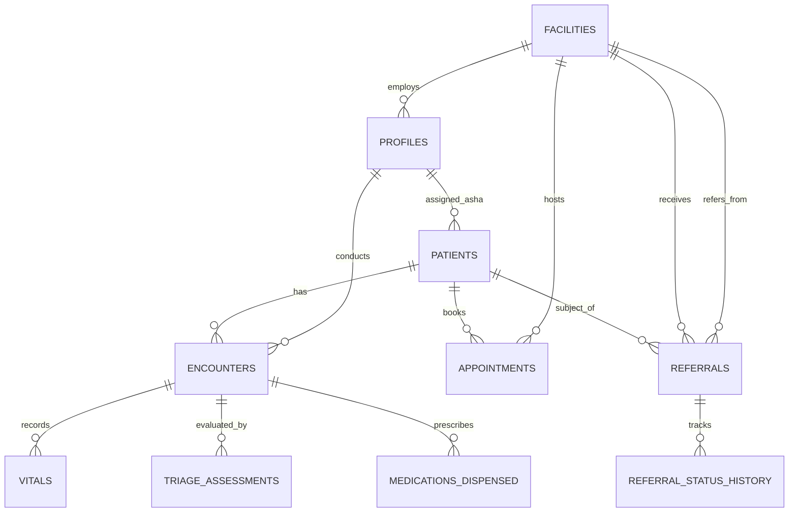

# CAREGRID: Database Schema & Entity Design

> **SIH Problem Statement**: SIH26133 — Accessibility & Quality of Public Healthcare in Rural/Underserved Areas  
> **Target Jurisdiction**: Government of Maharashtra (Public Health Department)  
> **Database Engine**: PostgreSQL 15+ (Hosted on Supabase with PostGIS & RLS)  

---

## 1. Schema Design Principles

1. **Relational Integrity with Health Records**: Patient identity, longitudinal encounters, clinical vitals, triage records, referrals, and appointments are linked via strict foreign key relationships with cascading rules that protect historical health data from accidental deletion.
2. **Auditability by Design**: Every table contains `created_at`, `updated_at`, and `created_by` audit fields. Soft deletes (`is_active = FALSE` or `deleted_at`) are utilized for patient records to preserve historical continuity of care.
3. **Optimized for Low-Bandwidth Sync**: Records support microsecond timestamp tracking (`updated_at TIMESTAMPTZ DEFAULT NOW()`) and client-generated UUID primary keys (`id UUID PRIMARY KEY DEFAULT gen_random_uuid()`) to support offline-generated records.
4. **Row-Level Security (RLS) Ready**: Every clinical entity contains ownership and facility-scoping columns (`facility_id`, `created_by_role`, `assigned_asha_id`) so PostgreSQL policies can enforce strict access boundaries.

---

## 2. Entity Relationship Overview



---

## 3. Enumerated Types (Enums)

```sql
-- User Roles across Maharashtra Public Health Hierarchy
CREATE TYPE user_role AS ENUM (
    'citizen',            -- Patient / family member
    'asha_worker',        -- Accredited Social Health Activist (Village level)
    'anm_worker',         -- Auxiliary Nurse Midwife (Sub-Centre level)
    'medical_officer',    -- Doctor at PHC / CHC
    'specialist_doctor',  -- Specialist (Gynecologist, Pediatrician, Surgeon) at CHC / District Hospital
    'pharmacist',         -- Medicine inventory and dispensation manager
    'lab_technician',     -- Diagnostic sample and report manager
    'facility_admin',     -- PHC/CHC Medical Superintendent or Admin
    'district_officer',   -- District Health Officer (DHO) / Civil Surgeon
    'state_admin'         -- Maharashtra State Health Directorate
);

-- Health Facility Classification in Maharashtra
CREATE TYPE facility_type AS ENUM (
    'sub_centre',         -- Ayushman Arogya Mandir (Village Sub-Centre)
    'phc',                -- Primary Health Centre
    'chc',                -- Community Health Centre
    'rural_hospital',     -- Rural Hospital (RH)
    'sub_district_hosp',  -- Sub-District Hospital (SDH)
    'district_hospital',  -- District Hospital (DH)
    'medical_college'     -- Tertiary Government Medical College & Hospital
);

-- Clinical Urgency Priority Tiers (Strictly Non-Diagnostic)
CREATE TYPE urgency_tier AS ENUM (
    'emergency_red',   -- Immediate resuscitation / transfer required
    'urgent_amber',    -- Needs medical officer evaluation within 24-48 hours
    'routine_green'    -- Standard primary care, routine visit or preventive follow-up
);

-- Closed-Loop Referral Lifecycle
CREATE TYPE referral_status AS ENUM (
    'initiated',       -- Generated by ASHA or PHC doctor
    'in_transit',      -- Patient dispatched / ambulance assigned
    'acknowledged',    -- Receiving facility acknowledged and reserved bed/specialty
    'evaluated',       -- Patient reached receiving facility and examined by specialist
    'admitted',        -- Inpatient admission at higher facility
    'discharged',      -- Treatment completed; discharge summary generated
    'closed_loop'      -- Back-referral summary sent to originating PHC & village ASHA
);

-- Appointment & OPD Queue Status
CREATE TYPE appointment_status AS ENUM (
    'scheduled',
    'in_queue',
    'in_consultation',
    'completed',
    'cancelled',
    'no_show'
);
```

---

## 4. Core Table Specifications

### 1. `facilities`
Public healthcare infrastructure directory across Maharashtra districts (e.g., Pune, Nashik, Gadchiroli, Thane, Amravati).
- `id` (UUID, PK)
- `facility_code` (TEXT, UNIQUE) — National Health Facility Registry / Nin Code
- `name` (TEXT) — e.g., "PHC Bhamragad", "CHC Manchar", "District Hospital Nashik"
- `facility_type` (facility_type)
- `district` (TEXT)
- `taluka` (TEXT)
- `village` (TEXT, Nullable)
- `latitude` (NUMERIC(10,7))
- `longitude` (NUMERIC(10,7))
- `total_beds` (INTEGER)
- `available_beds` (INTEGER)
- `contact_number` (TEXT)
- `emergency_ambulance_number` (TEXT)
- `specialties_available` (TEXT[] / JSONB)
- `is_active` (BOOLEAN DEFAULT TRUE)

### 2. `profiles`
Extended user profiles linked to `auth.users`.
- `id` (UUID, PK, FK -> auth.users)
- `role` (user_role)
- `full_name` (TEXT)
- `phone_number` (TEXT)
- `preferred_language` (TEXT DEFAULT 'mr') — 'mr', 'hi', 'en'
- `facility_id` (UUID, FK -> facilities, Nullable for citizens/state officials)
- `assigned_village` (TEXT, Nullable for ASHAs)
- `registration_number` (TEXT, Nullable for doctors/ANMs)
- `created_at` (TIMESTAMPTZ)
- `updated_at` (TIMESTAMPTZ)

### 3. `patients`
Longitudinal demographic and master identity records.
- `id` (UUID, PK)
- `abha_id` (TEXT, UNIQUE, Nullable) — Ayushman Bharat Health Account
- `national_id_hash` (TEXT, Nullable) — SHA256 hashed identity token for deduplication
- `full_name` (TEXT)
- `date_of_birth` (DATE)
- `gender` (TEXT) — 'male', 'female', 'other'
- `blood_group` (TEXT, Nullable)
- `primary_phone` (TEXT)
- `village` (TEXT)
- `taluka` (TEXT)
- `district` (TEXT)
- `assigned_asha_id` (UUID, FK -> profiles, Nullable)
- `primary_facility_id` (UUID, FK -> facilities)
- `is_pregnant` (BOOLEAN DEFAULT FALSE)
- `chronic_conditions` (TEXT[] DEFAULT '{}') — e.g. Hypertension, Diabetes, Asthma
- `created_by` (UUID, FK -> profiles)
- `created_at` (TIMESTAMPTZ)
- `updated_at` (TIMESTAMPTZ)

### 4. `encounters`
Clinical interactions occurring at household, Sub-Centre, PHC, or hospital.
- `id` (UUID, PK)
- `patient_id` (UUID, FK -> patients)
- `facility_id` (UUID, FK -> facilities)
- `provider_id` (UUID, FK -> profiles)
- `encounter_type` (TEXT) — 'home_visit_asha', 'opd_consultation', 'teleconsultation', 'emergency'
- `chief_complaints` (JSONB) — structured list of symptoms, duration, severity
- `clinical_notes` (TEXT)
- `provisional_observations` (TEXT)
- `encounter_date` (TIMESTAMPTZ)
- `is_synced_from_offline` (BOOLEAN DEFAULT FALSE)
- `client_offline_id` (TEXT, Nullable)

### 5. `vitals`
Clinical observations recorded during an encounter.
- `id` (UUID, PK)
- `encounter_id` (UUID, FK -> encounters)
- `patient_id` (UUID, FK -> patients)
- `systolic_bp` (INTEGER, Nullable)
- `diastolic_bp` (INTEGER, Nullable)
- `heart_rate_bpm` (INTEGER, Nullable)
- `respiratory_rate_bpm` (INTEGER, Nullable)
- `spo2_percentage` (INTEGER, Nullable)
- `body_temperature_f` (NUMERIC(4,1), Nullable)
- `random_blood_glucose_mg_dl` (INTEGER, Nullable)
- `weight_kg` (NUMERIC(5,2), Nullable)
- `height_cm` (NUMERIC(5,2), Nullable)
- `fetal_heart_rate_bpm` (INTEGER, Nullable) — for pregnant patients
- `recorded_at` (TIMESTAMPTZ)

### 6. `triage_assessments`
Clinical urgency classification produced by the AI Assist Microservice.
- `id` (UUID, PK)
- `encounter_id` (UUID, FK -> encounters)
- `patient_id` (UUID, FK -> patients)
- `urgency_tier` (urgency_tier)
- `priority_score` (INTEGER) — 1 (Highest/Emergency) to 10 (Lowest)
- `detected_red_flags` (JSONB) — array of flags (e.g. "severe_hypoxia", "hypertensive_crisis")
- `vital_anomalies` (JSONB)
- `transport_recommended` (BOOLEAN)
- `recommended_specialty` (TEXT, Nullable)
- `disclaimer_acknowledged_by` (UUID, FK -> profiles, Nullable)
- `model_version` (TEXT)
- `assessed_at` (TIMESTAMPTZ)

### 7. `referrals`
Closed-loop transfer tracking across the public health system.
- `id` (UUID, PK)
- `referral_code` (TEXT, UNIQUE) — Human-readable token e.g. "REF-PUN-2026-0042"
- `patient_id` (UUID, FK -> patients)
- `encounter_id` (UUID, FK -> encounters)
- `from_facility_id` (UUID, FK -> facilities)
- `to_facility_id` (UUID, FK -> facilities)
- `referring_officer_id` (UUID, FK -> profiles)
- `receiving_doctor_id` (UUID, FK -> profiles, Nullable)
- `referral_reason` (TEXT)
- `required_specialty` (TEXT)
- `transport_arranged` (BOOLEAN DEFAULT FALSE)
- `ambulance_tracking_code` (TEXT, Nullable)
- `status` (referral_status DEFAULT 'initiated')
- `admission_date` (TIMESTAMPTZ, Nullable)
- `discharge_summary` (TEXT, Nullable)
- `post_discharge_instructions_for_asha` (TEXT, Nullable)
- `closed_at` (TIMESTAMPTZ, Nullable)
- `created_at` (TIMESTAMPTZ)
- `updated_at` (TIMESTAMPTZ)

### 8. `appointments`
Digital OPD queue tokens and rural teleconsultation scheduling.
- `id` (UUID, PK)
- `patient_id` (UUID, FK -> patients)
- `facility_id` (UUID, FK -> facilities)
- `doctor_id` (UUID, FK -> profiles, Nullable)
- `token_number` (INTEGER)
- `queue_tier` (urgency_tier DEFAULT 'routine_green')
- `appointment_type` (TEXT) — 'physical_opd', 'rural_teleconsultation'
- `scheduled_date` (DATE)
- `time_slot` (TEXT)
- `status` (appointment_status DEFAULT 'scheduled')
- `webrtc_room_id` (TEXT, Nullable) — For video teleconsultation
- `created_at` (TIMESTAMPTZ)

### 9. `audit_logs`
Immutable compliance and security trail for every clinical record access.
- `id` (BIGSERIAL, PK)
- `actor_id` (UUID, FK -> profiles)
- `action` (TEXT) — 'READ_PATIENT', 'WRITE_ENCOUNTER', 'REFERRAL_CREATE', etc.
- `resource_type` (TEXT)
- `resource_id` (UUID)
- `ip_address` (TEXT)
- `user_agent` (TEXT)
- `timestamp` (TIMESTAMPTZ DEFAULT NOW())
