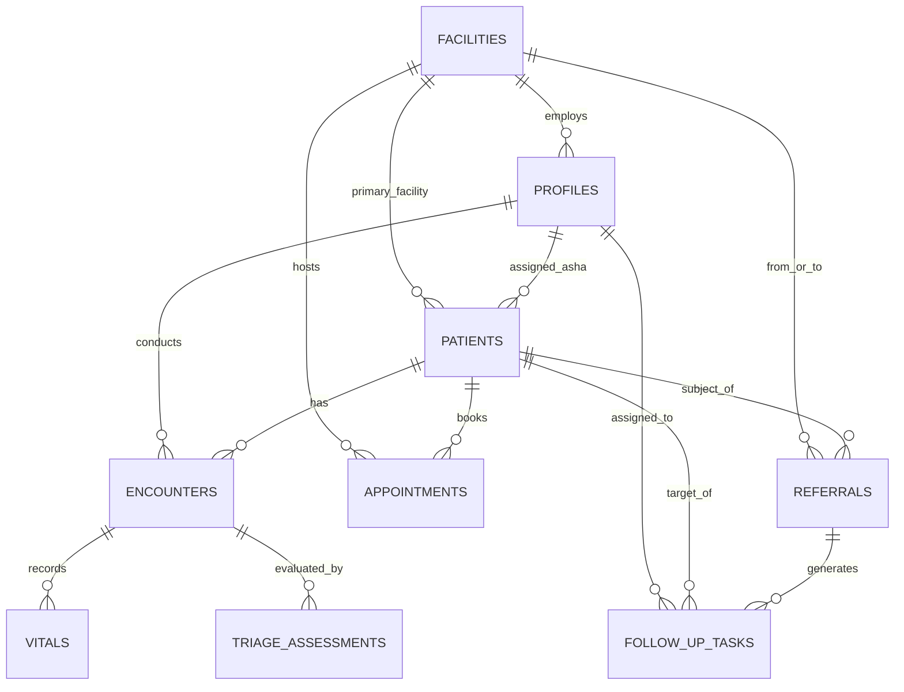

# CAREGRID: Database Schema & Entity Design (Revised MVP)

> **SIH Problem Statement**: SIH26133 — Accessibility & Quality of Public Healthcare in Rural/Underserved Areas  
> **Jurisdiction**: Government of Maharashtra (Public Health Department)  
> **Engine**: PostgreSQL 15+ (Supabase with RLS & PostGIS)  

---

## 1. Focused Schema Architecture

The database architecture is built specifically around the **11 MVP deliverables**:
1. Citizen/Patient Intake
2. ASHA Field Workflow
3. AI-Assisted Triage & Priority Support (Non-Diagnostic)
4. Facility & Service Discovery
5. Appointment, OPD Queue & Teleconsultation
6. Closed-Loop Referral Tracking
7. Basic Longitudinal Health Record
8. Follow-up & Continuity Tasks
9. Multilingual Support
10. Low-Connectivity / Offline Sync
11. Facility & Government Visibility

---

## 2. Entity Relationship Overview



---

## 3. Enumerated Types (Enums)

```sql
-- User Roles across Maharashtra Public Health Hierarchy
CREATE TYPE user_role AS ENUM (
    'citizen',            -- Patient / family member
    'asha_worker',        -- Accredited Social Health Activist (Village level)
    'anm_worker',         -- Auxiliary Nurse Midwife (Sub-Centre level)
    'medical_officer',    -- Doctor at PHC / CHC
    'specialist_doctor',  -- Specialist at CHC / District Hospital
    'facility_admin',     -- Facility Medical Superintendent or Admin
    'district_officer',   -- District Health Officer (DHO)
    'state_admin'         -- State Health Directorate
);

-- Health Facility Classification
CREATE TYPE facility_type AS ENUM (
    'sub_centre',         -- Ayushman Arogya Mandir (Village Sub-Centre)
    'phc',                -- Primary Health Centre
    'chc',                -- Community Health Centre
    'rural_hospital',     -- Rural Hospital (RH)
    'sub_district_hosp',  -- Sub-District Hospital (SDH)
    'district_hospital'   -- District Hospital (DH)
);

-- Clinical Urgency Priority Tiers (Strictly Non-Diagnostic)
CREATE TYPE urgency_tier AS ENUM (
    'emergency_red',   -- Immediate resuscitation / transfer required
    'urgent_amber',    -- Needs medical officer evaluation within 24-48 hours
    'routine_green'    -- Standard primary care, routine visit or preventive follow-up
);

-- Closed-Loop Referral Lifecycle
CREATE TYPE referral_status AS ENUM (
    'initiated',       -- Generated by ASHA or PHC doctor
    'acknowledged',    -- Receiving facility acknowledged referral
    'evaluated',       -- Patient examined by doctor at receiving facility
    'admitted',        -- Inpatient care at receiving facility
    'discharged',      -- Treatment completed; discharge summary generated
    'closed_loop'      -- Back-referral summary sent to originating PHC & ASHA
);

-- Appointment & OPD Queue Status
CREATE TYPE appointment_status AS ENUM (
    'scheduled',
    'in_queue',
    'in_consultation',
    'completed',
    'cancelled',
    'no_show'
);

-- Follow-Up Task Status
CREATE TYPE follow_up_status AS ENUM (
    'pending',
    'completed',
    'missed',
    'cancelled'
);
```

---

## 4. Core Table Specifications

### 1. `facilities` (Facility & Service Discovery)
Directory of public health infrastructure in Maharashtra.
- `id` (UUID, PK)
- `facility_code` (TEXT, UNIQUE) — e.g. "MAH-GAD-PHC-01"
- `name` (TEXT) — e.g. "PHC Bhamragad"
- `facility_type` (facility_type)
- `district` (TEXT)
- `taluka` (TEXT)
- `village` (TEXT, Nullable)
- `pincode` (TEXT)
- `latitude` (NUMERIC(10,7))
- `longitude` (NUMERIC(10,7))
- `contact_number` (TEXT)
- `operating_hours` (TEXT DEFAULT '24x7 for Emergency, 9 AM - 4 PM OPD')
- `services_available` (JSONB) — e.g. `["Normal Delivery", "Basic Lab Testing", "Immunization", "Teleconsultation Room"]`
- `specialties_available` (JSONB) — e.g. `["General Medicine", "Pediatrics"]`
- `is_active` (BOOLEAN DEFAULT TRUE)

### 2. `profiles` (User Management)
- `id` (UUID, PK, FK -> auth.users)
- `role` (user_role)
- `full_name` (TEXT)
- `phone_number` (TEXT)
- `preferred_language` (TEXT DEFAULT 'mr') — 'mr', 'hi', 'en'
- `facility_id` (UUID, FK -> facilities, Nullable)
- `assigned_village` (TEXT, Nullable for ASHAs)
- `assigned_taluka` (TEXT, Nullable)
- `assigned_district` (TEXT, Nullable)

### 3. `patients` (Intake & Master Identity)
- `id` (UUID, PK)
- `abha_id` (TEXT, UNIQUE, Nullable)
- `full_name` (TEXT)
- `date_of_birth` (DATE, Nullable)
- `estimated_age` (INTEGER)
- `gender` (TEXT) — 'male', 'female', 'other'
- `blood_group` (TEXT, Nullable)
- `primary_phone` (TEXT)
- `village` (TEXT)
- `taluka` (TEXT)
- `district` (TEXT)
- `assigned_asha_id` (UUID, FK -> profiles, Nullable)
- `primary_facility_id` (UUID, FK -> facilities)
- `is_pregnant` (BOOLEAN DEFAULT FALSE)
- `gestational_age_weeks` (INTEGER, Nullable)
- `high_risk_pregnancy` (BOOLEAN DEFAULT FALSE)
- `chronic_conditions` (TEXT[] DEFAULT '{}')
- `created_at` (TIMESTAMPTZ)
- `updated_at` (TIMESTAMPTZ)

### 4. `encounters` (Clinical Consultations & Field Visits)
- `id` (UUID, PK)
- `patient_id` (UUID, FK -> patients)
- `facility_id` (UUID, FK -> facilities, Nullable)
- `provider_id` (UUID, FK -> profiles)
- `encounter_type` (TEXT) — 'asha_home_visit', 'phc_opd', 'teleconsultation'
- `chief_complaints` (JSONB)
- `clinical_notes` (TEXT)
- `provisional_observations` (TEXT)
- `diagnostic_tests_ordered` (JSONB DEFAULT '[]')
- `advised_medications` (JSONB DEFAULT '[]')
- `encounter_date` (TIMESTAMPTZ DEFAULT NOW())
- `is_synced_from_offline` (BOOLEAN DEFAULT FALSE)
- `client_offline_id` (TEXT, Nullable)

### 5. `vitals` (Intake & Monitoring)
- `id` (UUID, PK)
- `encounter_id` (UUID, FK -> encounters)
- `patient_id` (UUID, FK -> patients)
- `systolic_bp` (INTEGER, Nullable)
- `diastolic_bp` (INTEGER, Nullable)
- `heart_rate_bpm` (INTEGER, Nullable)
- `respiratory_rate_bpm` (INTEGER, Nullable)
- `spo2_percentage` (INTEGER, Nullable)
- `body_temperature_f` (NUMERIC(4,1), Nullable)
- `random_blood_glucose_mg_dl` (INTEGER, Nullable)
- `fetal_heart_rate_bpm` (INTEGER, Nullable)
- `recorded_at` (TIMESTAMPTZ DEFAULT NOW())

### 6. `triage_assessments` (AI Clinical Decision Support)
- `id` (UUID, PK)
- `encounter_id` (UUID, FK -> encounters)
- `patient_id` (UUID, FK -> patients)
- `urgency_tier` (urgency_tier)
- `priority_score` (INTEGER CHECK (priority_score BETWEEN 1 AND 10))
- `detected_red_flags` (JSONB DEFAULT '[]')
- `vital_anomalies` (JSONB DEFAULT '[]')
- `transport_recommended` (BOOLEAN DEFAULT FALSE)
- `recommended_specialty` (TEXT, Nullable)
- `clinical_rationale` (TEXT)
- `non_diagnostic_disclaimer` (TEXT)
- `clinician_acknowledged_by` (UUID, FK -> profiles, Nullable)
- `assessed_at` (TIMESTAMPTZ DEFAULT NOW())

### 7. `appointments` (OPD Queue & Teleconsultation)
- `id` (UUID, PK)
- `patient_id` (UUID, FK -> patients)
- `facility_id` (UUID, FK -> facilities)
- `doctor_id` (UUID, FK -> profiles, Nullable)
- `token_number` (INTEGER)
- `queue_tier` (urgency_tier DEFAULT 'routine_green')
- `appointment_type` (TEXT DEFAULT 'physical_opd') -- 'physical_opd' | 'rural_teleconsultation'
- `scheduled_date` (DATE DEFAULT CURRENT_DATE)
- `status` (appointment_status DEFAULT 'in_queue')
- `webrtc_room_id` (TEXT, Nullable)
- `created_at` (TIMESTAMPTZ DEFAULT NOW())

### 8. `referrals` (Closed-Loop Referral Tracking)
- `id` (UUID, PK)
- `referral_code` (TEXT, UNIQUE) — e.g. "REF-GAD-2026-0012"
- `patient_id` (UUID, FK -> patients)
- `encounter_id` (UUID, FK -> encounters, Nullable)
- `from_facility_id` (UUID, FK -> facilities)
- `to_facility_id` (UUID, FK -> facilities)
- `referring_officer_id` (UUID, FK -> profiles)
- `receiving_doctor_id` (UUID, FK -> profiles, Nullable)
- `referral_reason` (TEXT NOT NULL)
- `required_specialty` (TEXT NOT NULL)
- `urgency_tier` (urgency_tier NOT NULL DEFAULT 'urgent_amber')
- `status` (referral_status DEFAULT 'initiated')
- `discharge_summary` (TEXT, Nullable)
- `post_discharge_instructions_for_asha` (TEXT, Nullable)
- `closed_at` (TIMESTAMPTZ, Nullable)
- `created_at` (TIMESTAMPTZ DEFAULT NOW())
- `updated_at` (TIMESTAMPTZ DEFAULT NOW())

### 9. `follow_up_tasks` (Continuity of Care)
- `id` (UUID, PK)
- `patient_id` (UUID, FK -> patients)
- `assigned_asha_id` (UUID, FK -> profiles)
- `originating_referral_id` (UUID, FK -> referrals, Nullable)
- `task_type` (TEXT NOT NULL) — 'post_referral_check', 'maternal_anc_check', 'chronic_vitals_check', 'routine_follow_up'
- `due_date` (DATE NOT NULL)
- `status` (follow_up_status DEFAULT 'pending')
- `completion_notes` (TEXT, Nullable)
- `completed_at` (TIMESTAMPTZ, Nullable)
- `created_at` (TIMESTAMPTZ DEFAULT NOW())

### 10. `audit_logs` (Security & Privacy Compliance)
- `id` (BIGSERIAL, PK)
- `actor_id` (UUID, FK -> profiles)
- `action` (TEXT NOT NULL)
- `resource_type` (TEXT NOT NULL)
- `resource_id` (UUID)
- `timestamp` (TIMESTAMPTZ DEFAULT NOW())
