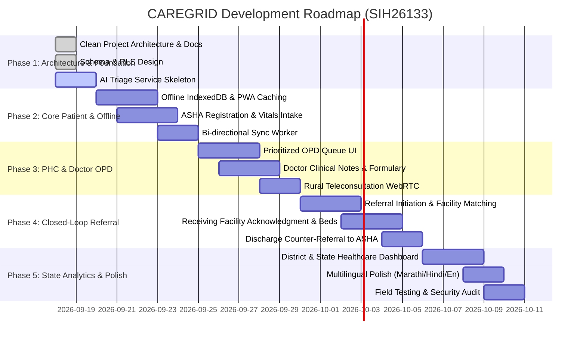

# CAREGRID: Phased Development Roadmap

> **SIH Problem Statement**: SIH26133 — Accessibility & Quality of Public Healthcare in Rural/Underserved Areas  
> **Target Jurisdiction**: Government of Maharashtra (Public Health Department)  
> **Team**: The Glitch Gang (Team ID: 129855)  

---

## 1. Roadmap Overview

---

## 2. Milestone Deliverables

### Phase 1: Architecture, Schemas & AI Microservice Foundation (Current)
- [x] Production repository layout without legacy water-monitoring artifacts.
- [x] Comprehensive architecture, database schema, security/privacy, and clinical triage documentation.
- [x] Production `.gitignore` and `.env.example`.
- [x] Complete PostgreSQL database migration scripts with enums, tables, and Row-Level Security (RLS).
- [x] Seed data with realistic Maharashtra public healthcare facilities (Nashik, Gadchiroli, Pune).
- [x] Standalone FastAPI microservice for non-diagnostic clinical triage scoring and maternal/pediatric red-flag detection.

### Phase 2: Offline-First PWA & ASHA Field Module
- [ ] Progressive Web App service worker setup with asset precaching and offline fallback.
- [ ] IndexedDB local storage engine (`Dexie.js`) for local patient records and vitals.
- [ ] Background sync queue with idempotency keys and retry management.
- [ ] Multilingual mobile-first ASHA intake forms (Marathi / Hindi / English).
- [ ] Client-side pre-triage alert engine for zero-connectivity emergency notification.

### Phase 3: PHC Digital OPD & Doctor Workspace
- [ ] Dynamic, urgency-sorted OPD Queue (Emergency Red, Urgent Amber, Routine Green).
- [ ] Longitudinal patient timeline (vitals trend chart, previous encounters, allergies).
- [ ] Essential medicine prescription formulary aligned with Maharashtra state essential drug lists.
- [ ] Low-bandwidth rural teleconsultation interface connecting PHCs to Sub-District and District specialists.

### Phase 4: Closed-Loop Referral System
- [ ] Smart referral generator with facility capability matching (ICU beds, specialists, blood bank availability).
- [ ] Live ambulance tracking code and transit status updates.
- [ ] Receiving hospital intake dashboard with 1-click bed reservation.
- [ ] Back-referral counter discharge summary dispatched back to originating PHC and local ASHA for home follow-up.

### Phase 5: District/State Health Administration & Field Validation
- [ ] High-density analytics portal for Taluka Health Officers (THO) and District Health Officers (DHO).
- [ ] Real-time referral drop-off heatmaps and facility bed utilization rates.
- [ ] Disease symptom cluster tracking (e.g., unusual spikes in fever or acute respiratory distress in a taluka).
- [ ] End-to-end integration tests and load tests on 2G/3G throttled networks.
