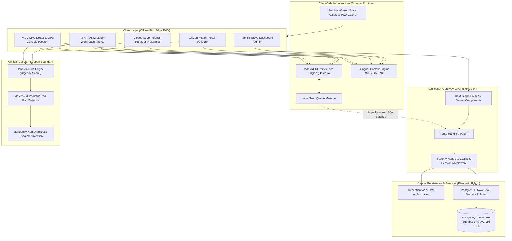
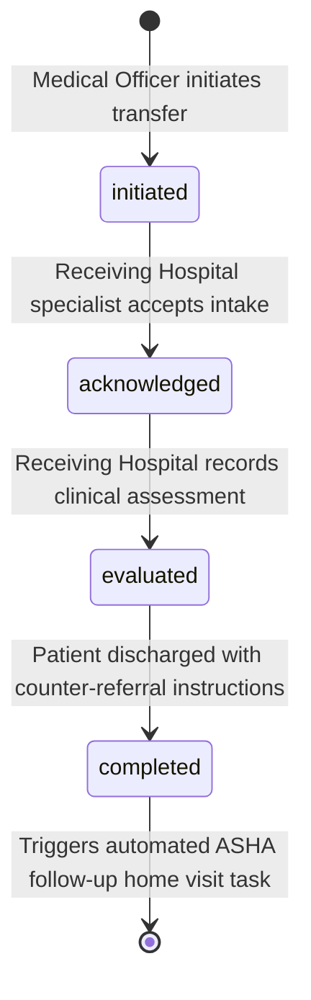

# Technical Requirements Document (TRD) v1.0
## CAREGRID — Rural Healthcare Access & Care Coordination Platform

---

| Document Metadata | Specification Details |
| :--- | :--- |
| **Document Title** | **CAREGRID Technical Requirements Document (TRD)** |
| **Document Version** | **1.0 (Final Architectural & Engineering Specification)** |
| **Release Date** | September 19, 2026 |
| **Base PRD Reference** | [`docs/PRD-v1.0.md`](file:///c:/Users/CAREGRID/docs/PRD-v1.0.md) (Approved) |
| **Problem Statement** | **SIH26133**: Accessibility & Quality of Public Healthcare in Rural/Underserved Areas |
| **Nodal Jurisdiction** | **Government of Maharashtra** — Public Health Department (सार्वजनिक आरोग्य विभाग) |
| **Engineering Team** | **The Glitch Gang** (Team ID: 129855) |
| **Implementation Stage** | **Production Prototype Verified** (Sprints 1–5 Implemented, Tested, & Verified in E2E Browser QA) |
| **Core Tech Stack** | Next.js 14 (App Router), React 18, TypeScript 5, Tailwind CSS, Dexie.js (IndexedDB), Supabase/PostgreSQL 15+, Python/FastAPI Microservice (AI Triage Assist) |

---

## 1. System Architecture

### 1.1 High-Level Architectural Topology
CAREGRID is architected as an **offline-first, event-driven progressive web and API platform** designed to bridge connectivity voids across remote tribal and rural areas of Maharashtra. The topology decouples client-side transactional workflows from backend availability, ensuring full autonomous operation at the edge.



### 1.2 Core Architectural Principles
1. **Edge-Autonomy First**: Every fundamental clinical interaction (patient registration, vitals recording, queue token generation, referral initiation) executes in < 50ms locally against IndexedDB with zero network roundtrips.
2. **Truthful Telemetry**: The UI dynamically reflects actual network and synchronization states. It never falsely claims active cloud synchronization when remote cloud endpoints are unconfigured.
3. **Assistive & Non-Diagnostic AI Guardrail**: All clinical decision support is strictly limited to administrative urgency ranking and vital sign anomaly flagging. The system never generates disease diagnoses or automated drug prescriptions.
4. **Strict SIH26133 Boundaries**: Zero code or database models exist for water testing, water sensors, outbreak forecasting, 108 ambulance fleet dispatch, or hospital bed telemetry.

---

## 2. Frontend Architecture

### 2.1 Technology Stack
- **Framework**: Next.js 14.2.15 (React 18.3, App Router paradigm).
- **Language**: TypeScript 5.4+ with strict null checks enabled (`noImplicitAny`, `strictNullChecks`).
- **Styling**: Tailwind CSS v3.4 with custom public health design system tokens (CareGrid teal `#0284c7` / `#0f766e`, urgency red `#dc2626`, urgent amber `#f59e0b`, routine green `#16a34a`).
- **Icons**: Lucide React (`lucide-react`) with tree-shaken SVGs.
- **Client Storage**: Dexie.js 4.0.8 wrapper around native browser IndexedDB.
- **Rendering Strategy**: Static Site Generation (SSG) for static landing surfaces combined with Client-Side Hydrated Interactive Components for role-based offline workspaces.

### 2.2 Directory Structure & Module Boundary
```
frontend/src/
├── app/                                 # Next.js App Router Hierarchy
│   ├── (dashboard)/                     # Route Group for Workspace Surfaces
│   │   ├── admin/page.tsx               # Administrative Visibility Dashboard
│   │   ├── asha/page.tsx                # ASHA / ANM Mobile Field Workspace
│   │   ├── citizen/page.tsx             # Citizen Portal & Longitudinal Record
│   │   ├── doctor/page.tsx              # PHC / CHC Doctor & OPD Queue Console
│   │   └── referrals/page.tsx           # Closed-Loop Referral Tracking Manager
│   ├── api/                             # Serverless Route Handlers
│   │   ├── facilities/route.ts          # Facility Discovery Endpoint
│   │   ├── follow-ups/route.ts          # ASHA Follow-Up Task Endpoint
│   │   ├── patients/route.ts            # Patient Registration & Query Endpoint
│   │   ├── referrals/route.ts           # Inter-Facility Referral Endpoint
│   │   ├── sync/route.ts                # Offline Sync Batch Receiver
│   │   └── triage/route.ts              # AI Triage Prioritization Endpoint
│   ├── globals.css                      # Tailwind Utility Imports & CSS Resets
│   ├── layout.tsx                       # Root Layout (LanguageProvider, OfflineBanner)
│   └── page.tsx                         # Landing Page & Trilingual Navigation Portal
├── components/                          # Modular UI Components
│   ├── analytics/                       # KPI Stat Cards, Metrics Panels, Charts
│   ├── asha/                            # Roster, Intake Form, Vitals, Sync Modal
│   ├── facilities/                      # Directory Search, Specialty Filters
│   ├── queue/                           # Digital OPD Queue, Token Generator
│   ├── records/                         # Longitudinal Timeline, Reminders Modal
│   ├── referrals/                       # Referral Stepper, Evaluation/Discharge Modals
│   ├── shared/                          # LanguageSwitcher, OfflineBanner
│   ├── teleconsult/                     # Rural Teleconsult Canvas, Low-Bandwidth Mode
│   └── triage/                          # Triage Assessment Cards, Doctor Override Modal
├── hooks/                               # Custom React Hooks
│   └── use-network-status.ts            # Network State, Sync Queue Length, Truthful Banner
├── lib/                                 # Shared Libraries & Business Engines
│   ├── ai-client/                       # Non-Diagnostic Triage Urgency Scorer
│   ├── analytics/                       # Telemetry Computation & Privacy Redaction
│   ├── i18n/                            # Localization Context & 266-Key Dictionaries
│   ├── offline-sync/                    # Dexie DB, Patient/Referral Services, SyncManager
│   └── supabase/                        # Supabase Browser & Server Client Factories
└── types/                               # TypeScript Domain Definitions
    └── healthcare.ts                    # Canonical Healthcare Entities & Urgency Tiers
```

---

## 3. Backend / API Architecture

### 3.1 Next.js App Router Route Handlers
The API layer executes as lightweight, edge-compatible route handlers residing in `frontend/src/app/api/`:

| Endpoint Route | HTTP Methods | Purpose | Input / Payload | Response Format |
| :--- | :---: | :--- | :--- | :--- |
| `/api/patients` | `GET`, `POST` | Patient intake and demographic retrieval | `Patient` JSON schema | `{ success: true, patient: Patient }` |
| `/api/triage` | `POST` | Urgency triage scoring & danger sign evaluation | `{ patient, vitals, symptoms }` | `TriageAssessment` JSON + Disclaimer |
| `/api/referrals` | `GET`, `POST`, `PATCH`| Lifecycle transitions (`REF-MH-*`) | Referral metadata / status update | `{ success: true, referral: Referral }` |
| `/api/facilities` | `GET` | Geo-aware public facility search | `?district=Gadchiroli&specialty=OBG` | `{ facilities: Facility[] }` |
| `/api/follow-ups` | `GET`, `POST`, `PATCH`| ASHA home visit counter-tasks | Task resolution notes & vitals | `{ success: true, task: FollowUpTask }` |
| `/api/sync` | `POST` | Idempotent sync queue ingestion | `OfflineSyncItem` schema | `{ success: true, synced_at: string }` |

### 3.2 Request Lifecycle & Middleware Processing
1. **Request Reception**: Request arrives via HTTPS at Next.js edge runtime.
2. **CORS & Security Headers**: Evaluated against security policies defined in `next.config.mjs` (`X-Frame-Options: SAMEORIGIN`, `X-Content-Type-Options: nosniff`, `Content-Security-Policy`).
3. **Payload Validation**: Strict structural validation checking required fields (`entity_type`, `payload`, `patient_id`).
4. **Idempotent Upsert Logic**: Upserts evaluated by deterministic `id` (UUIDv4) preventing duplicate creation during retried sync requests.
5. **JSON Serialization**: Standardized RFC 7807 compliant error bodies on failure; standardized payload contracts on success.

---

## 4. Database Architecture

### 4.1 Client-Side Database Schema (IndexedDB via Dexie.js)
```typescript
// frontend/src/lib/offline-sync/db.ts
export class CareGridLocalDB extends Dexie {
  localPatients!: Table<Patient, string>;
  localEncounters!: Table<Encounter, string>;
  localAppointments!: Table<Appointment, string>;
  localFacilities!: Table<Facility, string>;
  localReferrals!: Table<Referral, string>;
  localFollowUps!: Table<FollowUpTask, string>;
  syncQueue!: Table<OfflineSyncItem, string>;

  constructor() {
    super('CareGridOfflineDB');
    this.version(1).stores({
      localPatients: 'id, village, is_pregnant, high_risk_pregnancy, created_at',
      localEncounters: 'id, patient_id, encounter_type, created_at',
      localAppointments: 'id, patient_id, facility_id, queue_tier, status, scheduled_time',
      localFacilities: 'id, name, facility_type, district, taluka',
      localReferrals: 'id, referral_code, patient_id, from_facility_id, to_facility_id, status, created_at',
      localFollowUps: 'id, referral_id, patient_id, assigned_asha_id, due_date, status, created_at',
      syncQueue: 'id, entity_type, status, created_at'
    });
  }
}
```

### 4.2 Central PostgreSQL Relational Schema (PostgreSQL 15+ / Supabase)
The central relational schema enforces referential integrity, relational constraints, and timestamp auditing:

```sql
-- 1. Core Enumerations
CREATE TYPE user_role AS ENUM ('citizen', 'asha_worker', 'anm_worker', 'medical_officer', 'specialist_doctor', 'administrative_officer');
CREATE TYPE urgency_tier AS ENUM ('emergency_red', 'urgent_amber', 'routine_green');
CREATE TYPE referral_status AS ENUM ('initiated', 'acknowledged', 'evaluated', 'completed', 'cancelled');
CREATE TYPE appointment_status AS ENUM ('in_queue', 'in_consultation', 'completed', 'referred', 'no_show');
CREATE TYPE follow_up_status AS ENUM ('pending', 'completed', 'escalated', 'missed');

-- 2. Patients Table
CREATE TABLE public.patients (
    id UUID PRIMARY KEY DEFAULT gen_random_uuid(),
    health_id_code VARCHAR(32) UNIQUE NOT NULL, -- Format: CARE-MH-YYYY-XXXX
    full_name VARCHAR(255) NOT NULL,
    age INT NOT NULL CHECK (age >= 0 AND age <= 125),
    gender VARCHAR(16) NOT NULL CHECK (gender IN ('male', 'female', 'other')),
    phone VARCHAR(15),
    village VARCHAR(100) NOT NULL,
    taluka VARCHAR(100) NOT NULL,
    district VARCHAR(100) NOT NULL,
    is_pregnant BOOLEAN DEFAULT FALSE,
    gestational_age_weeks INT CHECK (gestational_age_weeks >= 1 AND gestational_age_weeks <= 44),
    high_risk_pregnancy BOOLEAN DEFAULT FALSE,
    chronic_conditions TEXT[],
    assigned_asha_id UUID,
    created_at TIMESTAMPTZ DEFAULT NOW(),
    updated_at TIMESTAMPTZ DEFAULT NOW()
);

-- 3. Referrals Table (Closed-Loop Continuum)
CREATE TABLE public.referrals (
    id UUID PRIMARY KEY DEFAULT gen_random_uuid(),
    referral_code VARCHAR(32) UNIQUE NOT NULL, -- Format: REF-MH-[DIST]-[NUM]
    patient_id UUID NOT NULL REFERENCES public.patients(id) ON DELETE RESTRICT,
    from_facility_id VARCHAR(64) NOT NULL,
    to_facility_id VARCHAR(64) NOT NULL,
    referring_officer_id VARCHAR(64) NOT NULL,
    receiving_doctor_id VARCHAR(64),
    referral_reason TEXT NOT NULL,
    required_specialty VARCHAR(100) NOT NULL,
    urgency_tier urgency_tier NOT NULL DEFAULT 'routine_green',
    status referral_status NOT NULL DEFAULT 'initiated',
    discharge_summary TEXT,
    asha_instructions TEXT,
    created_at TIMESTAMPTZ DEFAULT NOW(),
    updated_at TIMESTAMPTZ DEFAULT NOW()
);

-- 4. Follow-Up Tasks Table (Continuity of Care)
CREATE TABLE public.follow_up_tasks (
    id UUID PRIMARY KEY DEFAULT gen_random_uuid(),
    referral_id UUID REFERENCES public.referrals(id) ON DELETE SET NULL,
    patient_id UUID NOT NULL REFERENCES public.patients(id) ON DELETE CASCADE,
    assigned_asha_id VARCHAR(64) NOT NULL,
    task_type VARCHAR(64) NOT NULL, -- 'post_referral_check' | 'high_risk_pregnancy_visit' | 'routine_check'
    description TEXT NOT NULL,
    due_date TIMESTAMPTZ NOT NULL,
    status follow_up_status NOT NULL DEFAULT 'pending',
    completed_at TIMESTAMPTZ,
    notes TEXT,
    created_at TIMESTAMPTZ DEFAULT NOW()
);
```

---

## 5. Authentication & Authorization

### 5.1 Authentication Design
1. **Hybrid Identity Architecture**:
   - **Local Mode (Edge Field Working)**: In disconnected field environments, ASHA workers and PHC staff authenticate against a secure, locally cached credential session with PIN/biometric device lock.
   - **Cloud Mode (Central Persistence)**: When cloud synchronization is provisioned, session verification utilizes Supabase Auth emitting signed JSON Web Tokens (JWT) using asymmetric RS256/ES256 algorithms.
2. **Session Persistence**: JWT session tokens stored in secure, `httpOnly`, `SameSite=Lax` cookies; ephemeral in-memory state handles active client token rotation.

---

## 6. Role-Based Access Control (RBAC)

### 6.1 Role Hierarchy & Policy Enforcement
PostgreSQL Row-Level Security (RLS) policies govern data isolation at the database engine level:

```sql
-- Enable RLS on core tables
ALTER TABLE public.patients ENABLE ROW LEVEL SECURITY;
ALTER TABLE public.referrals ENABLE ROW LEVEL SECURITY;
ALTER TABLE public.follow_up_tasks ENABLE ROW LEVEL SECURITY;

-- 1. ASHA Field Worker: Access patients in assigned village only
CREATE POLICY asha_assigned_patients_policy ON public.patients
    FOR ALL
    TO authenticated
    USING (
        auth.jwt() ->> 'role' = 'asha_worker' AND 
        village = (auth.jwt() ->> 'assigned_village')
    );

-- 2. Medical Officer: Full read/write within assigned facility and referring continuum
CREATE POLICY doctor_facility_policy ON public.patients
    FOR ALL
    TO authenticated
    USING (
        auth.jwt() ->> 'role' IN ('medical_officer', 'specialist_doctor')
    );

-- 3. Administrative Officer: STRICTLY ZERO direct patient record access
CREATE POLICY admin_no_patient_access ON public.patients
    FOR SELECT
    TO authenticated
    USING (
        auth.jwt() ->> 'role' != 'administrative_officer'
    );
```

---

## 7. Offline-First Architecture

### 7.1 Client-Side Offline Storage Topology
```
[User Action: e.g. Register Patient / Screen Vitals]
                     │
                     ▼
       ┌───────────────────────────┐
       │ Commit to Dexie IndexedDB │  < 50ms (Immediate Success UI Feedback)
       └─────────────┬─────────────┘
                     │
                     ▼
       ┌───────────────────────────┐
       │ Enqueue in syncQueue DB   │  Status: PENDING
       └─────────────┬─────────────┘
                     │
      ┌──────────────┴──────────────┐
      │ Network Online?             │
     NO                            YES
      │                             │
      ▼                             ▼
[Keep Queued on Device]    [Process Batch to /api/sync]
(Honest Banner:            (Send HTTP POST with retry)
 Local Storage Active)              │
                            ┌───────┴───────┐
                          HTTP 200        HTTP Error
                            │               │
                            ▼               ▼
                     [Delete from Queue] [Increment retry_count]
```

### 7.2 Truthful Banner Engineering
The [`useNetworkStatus`](file:///c:/Users/CAREGRID/frontend/src/hooks/use-network-status.ts) hook and [`OfflineBanner`](file:///c:/Users/CAREGRID/frontend/src/components/shared/offline-banner.tsx) inspect network availability and cloud backend configuration:
- **Condition 1 (`!isOnline`)**: Amber Banner $\rightarrow$ `t.offlineBanner` (`Offline Mode: No network connection. Data safely saved locally on device.`)
- **Condition 2 (`isOnline && pendingCount > 0 && !isCloudConfigured`)**: Slate Banner $\rightarrow$ `t.localQueueBanner` (`Local Storage Active: Records queued on device (Cloud sync unconfigured)`).
- **Condition 3 (`isOnline && pendingCount > 0 && isCloudConfigured`)**: Teal Banner $\rightarrow$ `t.onlineSyncBanner` (`Connected: Syncing offline records with CAREGRID cloud...`).
- **Condition 4 (`isOnline && pendingCount === 0`)**: Returns `null` (Banner automatically hidden).

---

## 8. Sync and Conflict Handling

### 8.1 Sync Queue Lifecycle
```typescript
// frontend/src/types/healthcare.ts
export interface OfflineSyncItem {
  id: string; // Deterministic UUIDv4
  entity_type: 'patient' | 'encounter' | 'appointment' | 'referral' | 'follow_up';
  operation: 'CREATE' | 'UPDATE' | 'DELETE';
  payload: Record<string, any>;
  created_at: string;
  retry_count: number;
  status: 'PENDING' | 'SYNCING' | 'FAILED';
}
```

### 8.2 Conflict Resolution Strategy
1. **Client-Side UUIDv4 Assignment**: Primary keys are generated at the edge using cryptographically strong `crypto.randomUUID()`. This eliminates ID collisions when multiple offline devices sync simultaneously.
2. **Last-Write-Wins (LWW) with Monotonic Timestamps**: Entities maintain ISO-8601 UTC `updated_at` timestamps. In conflicting record updates, the most recent update timestamp takes precedence.
3. **Idempotent Ingestion**: Server endpoints evaluate payload `id`. If the record exists, fields are updated conditionally; if absent, inserted cleanly.

---

## 9. AI / ML Service Boundary

### 9.1 Architectural Scope & Boundary
The AI/ML service functions exclusively as a **Clinical Decision Support & Urgency Triage Microservice**:
- **Location**: Evaluated via client-side heuristic engine (`TriageService`) with optional acceleration via Next.js route handler (`/api/triage`).
- **Inputs**: Physiological vital signs (BP, Pulse, $SpO_2$, Temperature, Blood Sugar), active pregnancy status, gestational age, and binary clinical danger signs.
- **Outputs**: Urgency classification tier (`emergency_red`, `urgent_amber`, `routine_green`), clinical trigger explanation strings, suggested public health specialty destination, and non-diagnostic disclaimers.
- **STRICT PROHIBITION**:
  - NO disease classification or ICD-10 diagnostic coding.
  - NO automated medicine dosage or drug prescription generation.
  - NO epidemiological epidemic forecasting algorithms.

---

## 10. AI Non-Diagnostic Safety Design

### 10.1 Multi-Layer Clinical Safety Framework
```
┌────────────────────────────────────────────────────────────────────────┐
│                   AI NON-DIAGNOSTIC SAFETY FRAMEWORK                   │
├─────────────────────────┬──────────────────────────────────────────────┤
│ 1. Rule-Based Triage    │ Evaluates deterministic physiological vitals │
│    Classification       │ thresholds aligned with Indian Public Health │
│                         │ Standards (IPHS). Zero black-box outputs.    │
├─────────────────────────┼──────────────────────────────────────────────┤
│ 2. Mandatory Human      │ Medical Officers maintain absolute authority │
│    Physician Override   │ to modify or downgrade any urgency rating    │
│                         │ with a single click and audit justification. │
├─────────────────────────┼──────────────────────────────────────────────┤
│ 3. Permanent Visible    │ Explicit disclaimers rendered in Marathi,    │
│    Disclaimers          │ Hindi, and English across all assessment     │
│                         │ cards, referral sheets, and queue displays.  │
├─────────────────────────┼──────────────────────────────────────────────┤
│ 4. No Pharmaceutical    │ Prescription generation logic is strictly    │
│    Generation           │ excluded; advice is manually physician-typed.│
└─────────────────────────┴──────────────────────────────────────────────┘
```

### 10.2 Transparent Urgency Heuristics
```typescript
// frontend/src/lib/ai-client/triage-service.ts
if (systolic >= 160 || diastolic >= 110 || spo2 < 90 || hasMaternalDangerSigns) {
  urgency_tier = 'emergency_red';
  triggers.push('Severely elevated blood pressure or critical danger signs detected');
} else if (systolic >= 140 || diastolic >= 90 || spo2 <= 94 || hasPersistentFever) {
  urgency_tier = 'urgent_amber';
  triggers.push('Moderate physiological elevation requiring prompt clinical evaluation');
} else {
  urgency_tier = 'routine_green';
  triggers.push('Vitals within standard physiological baseline');
}
```

---

## 11. Multilingual Architecture

### 11.1 Implementation & Reactive Switching
- **Engine**: Client-side React Context (`LanguageProvider`) loading immutable dictionary trees.
- **Languages Supported**:
  1. **English (`en`)**: System default load language.
  2. **Hindi (`hi`)**: हिंदी.
  3. **Marathi (`mr`)**: मराठी (State language of Maharashtra).
- **Parity Guarantee**: Automated CI test suite verifies 100% dictionary key parity across all 266 keys (`test-sprint*.mjs`).
- **Persistence**: User language preference persists in browser `localStorage('caregrid_locale')`, falling back cleanly to English if unspecified.

---

## 12. Referral and Follow-Up Technical Flow

### 12.1 State Standard Tracking Code (`REF-MH-*`)
Referral tracking codes follow a standardized format:
`REF-MH-[DISTRICT_ABBREVIATION]-[TIMESTAMP_HEX]` (e.g., `REF-MH-GAD-7821`).

### 12.2 Closed-Loop State Machine


### 12.3 Automated Counter-Task Trigger
When a referral transitions to `completed`:
1. `ReferralService.completeReferral()` updates status in `localReferrals`.
2. Automatically generates a linked record in `localFollowUps`:
   ```typescript
   await offlineDb.localFollowUps.add({
     id: crypto.randomUUID(),
     referral_id: referralId,
     patient_id: referral.patient_id,
     assigned_asha_id: patient.assigned_asha_id || 'asha-001',
     task_type: 'post_referral_check',
     description: `Post-discharge verification: ${instructions}`,
     due_date: new Date(Date.now() + 48 * 3600 * 1000).toISOString(),
     status: 'pending'
   });
   ```

---

## 13. Appointment / Queue / Teleconsultation Architecture

### 13.1 OPD Priority Sorting Algorithm
Queue items are sorted through a deterministic composite comparator:
1. **Urgency Weight**: `emergency_red` (Weight 1) $\rightarrow$ `urgent_amber` (Weight 2) $\rightarrow$ `routine_green` (Weight 3).
2. **Chronological Arrival**: Items with identical urgency weights sort by `scheduled_time` ascending.

### 13.2 Rural Teleconsultation Architecture
- **Low-Bandwidth Mode**: Drops high-resolution video streams, prioritizing 16 kHz mono audio and real-time JSON vitals telemetry to function reliably over 2G/3G rural cellular connections.
- **Audio/Video Feed Simulation**: Accessible web canvas supporting clinical case notes, vital signs inspection, and consultation summary export.

---

## 14. Facility & Service Discovery

### 14.1 Public Healthcare Directory Schema
Facilities are indexed with spatial attributes and capability tags:
```typescript
export interface Facility {
  id: string;
  name: string;
  facility_type: 'sub_centre' | 'phc' | 'chc' | 'sub_district_hospital' | 'district_hospital';
  district: string;
  taluka: string;
  village?: string;
  services_offered: string[]; // e.g. ['General Medicine', 'Obstetrics', 'Laboratory']
  operating_hours: string;
  is_emergency_24_7: boolean;
  contact_number: string;
}
```
- Query filtering supports instantaneous taluka/district slicing and clinical specialty search (e.g., searching for sonography, blood storage, or C-section capability).

---

## 15. Dashboard Architecture

### 15.1 Real-Time Telemetry & Metric Engine
The Administrative Dashboard (`/admin`) computes 6 primary operational KPIs:
1. **Facility Coverage**: Count of active public healthcare centres monitored.
2. **Referral Volume**: Total patient transfers initiated across jurisdiction.
3. **Closed-Loop Completion Rate**: Percentage of referrals successfully tracked through discharge:
   $$\text{Closed-Loop Rate} = \left( \frac{\text{Completed Referrals}}{\text{Total Referrals}} \right) \times 100$$
4. **ASHA Follow-up Adherence**: Percentage of assigned home visits completed within window:
   $$\text{Adherence Rate} = \left( \frac{\text{Completed Follow-Ups}}{\text{Total Follow-Ups}} \right) \times 100$$
5. **Triage Urgency Ratio**: Proportional breakdown of Red, Amber, and Green acuity.
6. **Offline Sync Resilience**: Measure of successful edge queue clearances.

### 15.2 Planned Capability Governance
The dashboard explicitly renders the administrative planned capability notice banner, ensuring transparent governance representation.

---

## 16. API Contracts Overview

### 16.1 Ingestion Contract: `/api/sync`
- **Method**: `POST`
- **Payload Schema**:
  ```json
  {
    "id": "a9b8c7d6-1234-4567-89ab-cdef01234567",
    "entity_type": "patient",
    "operation": "CREATE",
    "payload": {
      "id": "a9b8c7d6-1234-4567-89ab-cdef01234567",
      "health_id_code": "CARE-MH-2026-A8F2",
      "full_name": "Anita Ramesh Meshram",
      "age": 28,
      "gender": "female",
      "village": "Reguntha",
      "taluka": "Sironcha",
      "district": "Gadchiroli",
      "is_pregnant": true,
      "high_risk_pregnancy": true
    },
    "created_at": "2026-09-19T05:00:00.000Z"
  }
  ```
- **Response Schema (`HTTP 200 OK`)**:
  ```json
  {
    "success": true,
    "id": "a9b8c7d6-1234-4567-89ab-cdef01234567",
    "entity_type": "patient",
    "synced_at": "2026-09-19T05:00:01.120Z"
  }
  ```

---

## 17. Data Security & Privacy

### 17.1 Security Architecture Safeguards
1. **Mathematical PII Decoupling**: Administrative telemetry aggregations execute over anonymous identifiers; names, phone numbers, and addresses are never transmitted to dashboard analytics endpoints.
2. **Local Storage Sandboxing**: IndexedDB databases are bound by browser origin security policies; sensitive auth tokens are never stored in plain-text local storage.
3. **Transport Encryption**: Enforced HTTPS/TLS 1.3 encryption across all network transmission.
4. **DPDPA 2023 Architectural Alignment**: Implements technical data minimization, purpose limitation, and storage limitation principles. *(Note: Represents technical architecture design intent and does not constitute formal statutory certification).*

---

## 18. Logging and Auditing

### 18.1 Audit Trail Specifications
- **Clinical Override Logging**: Every doctor urgency override requires and persists physician ID, previous tier, new tier, and mandatory justification string.
- **Referral State Audit**: Every referral transition records the acting user ID, originating facility ID, timestamp, and clinical notes.
- **Console Hygiene**: Zero runtime JavaScript errors or unhandled exceptions permitted in production builds.

---

## 19. Testing Architecture

### 19.1 Multi-Tier Testing Strategy
1. **Automated Sprint Regression Suites**: Executable Node.js ESM suites verifying schema integrity, trilingual key parity, triage heuristics, and analytics computations:
   - `frontend/scripts/test-sprint2.mjs` (Intake, Vitals, IndexedDB Schema)
   - `frontend/scripts/test-sprint3.mjs` (Triage Scoring, OPD Queue, Teleconsult)
   - `frontend/scripts/test-sprint4.mjs` (Closed-Loop Referrals, Timeline, Follow-ups)
   - `frontend/scripts/test-sprint5.mjs` (KPI Analytics, District Filters, Anonymization)
2. **End-to-End Headless Browser Automation**: Puppeteer test runner (`scratch/e2e_browser_test.mjs`) driving headless Google Chrome against production builds:
   - Verified across all 6 routes (`/`, `/asha`, `/doctor`, `/referrals`, `/citizen`, `/admin`).
   - Validates live DOM interactions, modal dialogs, language switches, and responsive layouts.
3. **Static Type Verification**: Strict TypeScript type checking (`npx tsc --noEmit`).

---

## 20. Deployment Architecture

### 20.1 Build & Runtime Specifications
- **Hosting Target**: Node.js 18+ runtime or containerized Docker container.
- **Production Build Command**: `next build` generating standalone production assets.
- **Web Server Runtime**: Node.js HTTP server (`next start`) bound to port 3000.
- **Static Asset Serving**: Hashed, immutable static CSS/JS chunks with 1-year cache headers (`Cache-Control: public, max-age=31536000, immutable`).

---

## 21. Environment & Configuration Management

### 21.1 Environment Variables Matrix
```ini
# Central Database & Backend Persistence (Optional / Planned Cloud)
NEXT_PUBLIC_SUPABASE_URL=https://your-project.supabase.co
NEXT_PUBLIC_SUPABASE_ANON_KEY=eyJhbGciOiJIUzI1NiIsInR5cCI...

# Application Environment
NODE_ENV=production
PORT=3000
NEXT_PUBLIC_APP_VERSION=1.0.0
```
- **Graceful Unconfigured Fallback**: If `NEXT_PUBLIC_SUPABASE_URL` is omitted, the application boots cleanly in local offline-first mode, informing users accurately via the local queue banner.

---

## 22. Interoperability Direction

### 22.1 Standards-Aligned Architectural Intent
- **Neutral Identifiers**: CAREGRID utilizes `CARE-MH-[YEAR]-[HEX]`. The system does NOT claim active ABDM/ABHA integration or certification.
- **FHIR R4 Schema Alignment**: Data models are structured in alignment with HL7 FHIR Release 4 resource concepts:
  - `Patient` $\leftrightarrow$ FHIR `Patient`
  - `Encounter` $\leftrightarrow$ FHIR `Encounter`
  - `Vitals` $\leftrightarrow$ FHIR `Observation`
  - `Referral` $\leftrightarrow$ FHIR `ServiceRequest`
- **Future Integration Runway**: Technical provisions allow future binding to state health registries once official government sandbox access and compliance certifications are granted.

---

*Document compiled and verified in strict accordance with SIH26133 by **The Glitch Gang** (Team ID: 129855) for the Government of Maharashtra Public Health Department.*
